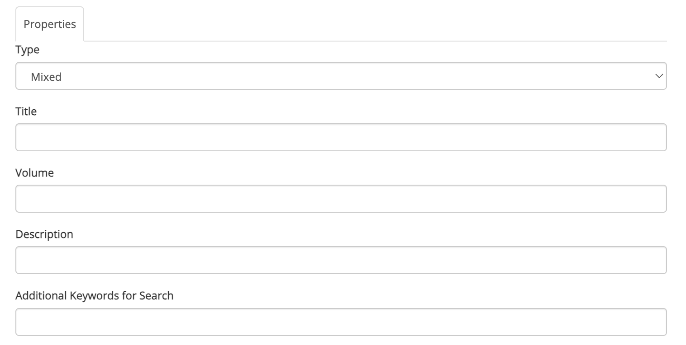

# Creating collections
Any registered user can create a custom collection.

To get started, click on **Create new > New collection** in the navbar or dropdown menu:

{ width="200" }
{ width="200" }

This will take you to the **Add Collection page** ([https://complib.org/collection/add](https://complib.org/collection/add)), which will look something like this:

{ width="400" }

The fields on this page allow you to set up the collection however you wish. Some of the fields are required, but most can be ignored unless you have need of them.

### Type
**Required**. A drop-down menu with three options:

Mixed
:   The default collection type. This specifies that the collection contains a mixture of compositions and methods.

Composition
:   The collection contains only compositions.

Method
:   The collection contains only methods.

The collection's type determines which Composition Library entries it can accept. This becomes relevant when [adding items to a collection](#adding-items-to-a-collection). It also affects the display of collection items when viewing a collection.

### Title
**Required**. The title of the collection. Has full Unicode support, including emoji.

### Volume
The name of the volume, for collections which are broken up into multiple volumes.

### Description
A text description of the collection and what it contains. Use this to indicate to others (or to remind yourself!) what the collection is for.

### Additional keywords for search

### Publication year

### ISBN

### Referenced by

### URL for creating page links

### URL for creating reference links

### Collection complete

## Adding items to a collection