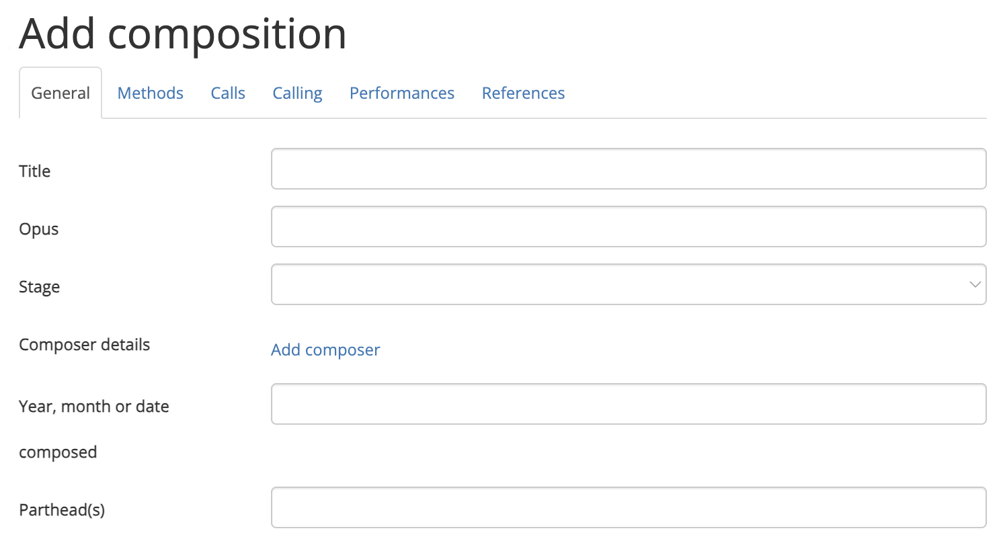

# Adding compositions
Any registered user can add a composition to the Composition Library.

To get started, click on **Create new > New composition** in the navbar or dropdown menu:

{ width="200" }
{ width="200" }

## The Add composition page
{ width="500"}

The Add composition page ([https://complib.org/composition/add](https://complib.org/composition/add)) has a number of fields which allow you to specify certain properties of your custom composition. Click on the name of a tab below to go to a dedicated page explaining how to use it.

[General](adding_compositions_tabs_general.md)
:   Specify high-level information about the composition such as its title, composer/arranger, number of parts, and so on.

[Methods](adding_compositions_tabs_methods.md)
:   Specify which methods are used in the composition, including custom definitions of existing methods and their method mnemonics.

[Calls](adding_compositions_tabs_calls.md)
:   Define the calls used in the composition, together with their corresponding [calling positions](calling_positions.md). This tab is often not needed, as most compositions use calls which Complib provides by default.

[Calling](adding_compositions_tabs_calling.md)
:   Edit the calling, or sequence of calls, which defines the composition.

Performances
:   Add performance information. Mostly used when uploading historical compositions.

References
:   Link the composition to collections within the Composition Library.

## Validating and saving compositions
If Complib is able to parse the composition as entered, then its generated title, [composition layout](#layout-display) and [blue line](#blue-line) will be displayed at the bottom of the page. Complib will automatically attempt to validate any composition it can parse. Clicking the **Validate** button will force a re-validation.

A composition which passes validation can be saved as a **private composition** by clicking the **Save** button. If the composition does not pass validation, one or more [validation errors](#validation-errors) will be displayed. The composition layout and blue line displays will highlight certain specific errors, to aid in troubleshooting. Non-critical [warnings](#validation-warnings) may also be given.

## Validation errors

If Complib encounters a critical problem when attempting to validate the composition, an error message will be displayed. **All errors must be cleared before a composition can be saved**.

There are a number of different error types. Most errors will give an indication of how to clear them. The following is a non-exhaustive list of some of the more common errors:

??? error "Error: Composition is false and cannot be saved unless overriden in the General tab"
    The composition as specified is false (that is, not true). See [Composition properties > Truth](composition_properties.md/#truth) for an explanation of what it means for a composition to be true.

    Since the vast majority of compositions which change ringers want to ring are true, Complib will not allow false compositions to be saved and published by default. However, this behaviour can be overridden in the General tab (see [General info > Allow save if false](adding_compositions_tabs_general.md/#allow-save-if-false)).

    A false composition will be indicated with a  next to its title on its composition page and in search results.

??? error "Error: Composition is not a round block."
    The composition as specified does not end at the same row it started from. There are various things which can cause this to happen, but most often it is due to a mistake in the calling.

??? error "Error: Unable to prick composition, or other errors need to be cleared."
    Complib is not able to prick (generate the rows of) the composition as it has been defined. Usually this means that some other error is preventing Complib from parsing the composition.

??? error "Error: Maximum false row limit reached."
    Complib will not automatically stop pricking a composition as soon as it runs false. However, in order to prevent the pricker from entering an infinite loop, there is an upper limit on the number of false rows which will be generated. This error means that the composition has reached that upper limit, and no more rows will be pricked in the [blue line display](#blue-line).

## Validation warnings

When validating a composition, Complib may generate one or more warnings. These contain information about the composition which you may wish to take into account before saving and/or publishing it. However, warnings by themselves do not prevent compositions from being saved.

## Tab-specific warnings and errors
A number of warnings and errors relate to specific tabs in the composition editor. In such cases, the validation readout will list the tab which is responsible for causing the warning or error.

Information on how to clear tab-specific warnings and errors can be found on the Help pages for each tab, accessible via the sidebar. [See above](adding_compositions_overview.md/#the-add-composition-page) for a brief description of the tabs.

## Layout display
A parsed composition will be laid out by Complib at the bottom of the page. For an overview of the various parts of a composition layout, see [Composition pages > Layout](overview.md/#layout). 

The appearance of the layout is determined by the current configuration of the [composition layout options](layout_options.md). The layout options can be adjusted by clicking on the {width="25"} cog next to the **Validate** button.

## Blue line
Underneath the layout of a parsed composition, Complib will also give the pricked rows of the composition in a dedicated Blue line tab. The tab can be expanded by clicking on its name. When expanded, it will look something like this:

{width="500"}

The appearance of the blue line display is determined by the [blue line display options](../methods/blueline_options.md) you have configured. These can be adjusted by clicking on the {width="25"} cog at the top right of the tab.

For more info on the blue line display for compositions, see [Composition pages > Blue line](overview.md/#blue-line).

## Publishing compositions
A custom composition which is successfully saved to Complib becomes a **private composition** and is given its own [composition page](overview.md). Private compositions are only visible to their owners, until they are published or shared via public link.

To publish a private composition, click the {width="25"} Publish button in the toolbar at the top of the composition page. This will add the composition to Complib's `Public` library, so that it is visible to anyone using the site.

!!! warning
    A published composition cannot be un-published (though it can still be edited or deleted). You should make sure that you want a composition to be visible before publishing it.

### Sharing via public link
Normally, a private composition is only visible to the user who owns it. However, you might want to share your private composition with others. You can do this by sharing via a public link.

To generate a public link, click on the {width="25"}share button in the toolbar at the top of the composition's page. This will open a window containing a link which you can copy to your clipboard.

Sharing a private composition via public link **does not publish it**. If you want your private composition to be visible to anyone who uses Complib, you should consider publishing it instead.

## Editing and deleting compositions
To edit a custom composition, click on the {width="25"}edit button in the toolbar. This will open the composition in the editor, allowing you to change its various properties.

To delete a custom composition, click on the {width="25"}delete button in the toolbar. This will bring up a prompt asking you to confirm that you want to delete the composition. Clicking on **Confirm Delete** will delete the composition from Complib.

!!! warning 
    Unlike [deleted methods](../methods/adding_methods.md/#editing-and-deleting-methods), compositions are deleted immediately and can no longer be recovered. If you have [shared the composition via a public link](#sharing-via-public-link), the link will no longer function.

### Redirecting external references
Complib allows various external sites such as BellBoard ([https://bb.ringingworld.co.uk/](https://bb.ringingworld.co.uk/)) to reference public compositions via their Composition Id. Deleting a composition will break any external links which reference it.

For this reason, the delete confirmation prompt lets you specify another composition which any such external links should be redirected to: simply enter the alternative composition's Composition Id in the provided text box. The Composition Id can be found in the [Library Details tab](overview.md/#library-details) on its composition page; it is also the string of numbers at the end of the composition page URL.

!!! warning
    The redirection process cannot be undone, unless the new composition is also one that you own. You should be certain that the new composition is an appropriate substitute for the old one before redirecting.

