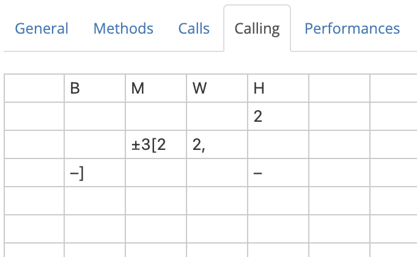
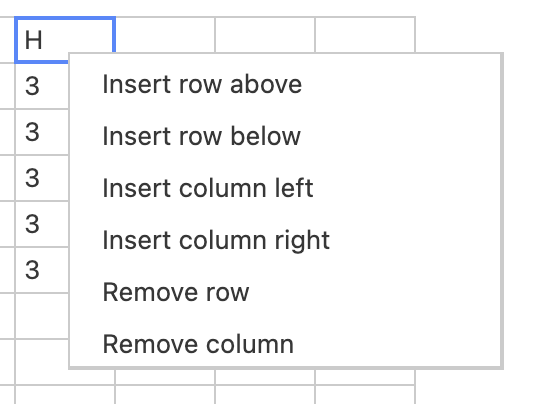
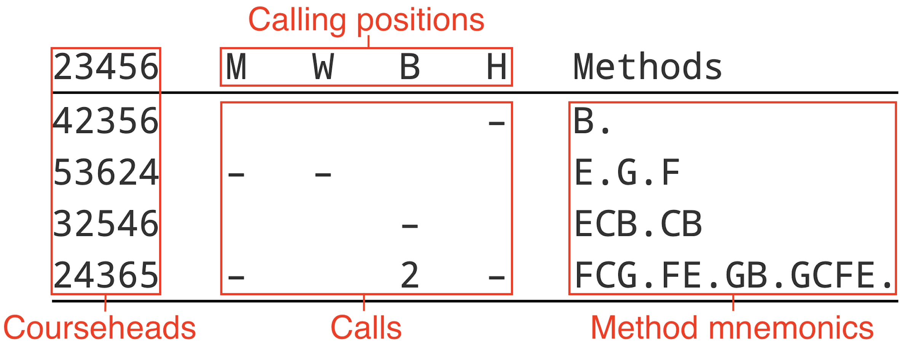

# The Calling tab

{width="400"}

The Calling tab is a spreadsheet in which the calling for a composition is defined. The calling specifies the sequence of calls (such as bobs and singles) which need to be made during a performance, including changes of method in Spliced.

## Editing the calling

To edit the calling, simply click on a cell in the table and type a value to enter it into that cell. 

Multiple cells can be highlighted by clicking and dragging. Alternatively, you can click on a cell, hold <kbd>Shift</kbd>, and then click on another cell to highlight a rectangle with those cells at opposite corners. Hold <kbd>Ctrl</kbd>/<kbd>⌘ Command</kbd> and click to select multiple individual cells.

⌫/<kbd>Backspace</kbd>/<kbd>Delete</kbd> will delete any values in selected cells.

Right-clicking on a cell will open a contextual menu, allowing you to manipulate the table by inserting or removing table rows and columns:

{width="300"}

## Anatomy of callings
Throughout the history of change ringing, a number of conventions have developed as to the form and format of compositions. The Calling tab aims to closely emulate many of these conventions.

A typical composition, such as might be found in the Ringing World Diary or in a book of compositions, is most often laid out as a table which may look something like this:

Some compositions have additional parts to their callings, and some may not have all the parts labelled here. The following sections contain information on the most common calling features, including what they represent and how to reproduce them in the Calling tab.

## Calling positions

### Default calling positions

### Custom calling positions

## Calls

### Complib call syntax

## Courseheads

### Manipulating course length

## Methods

### Method substitutions, etc.

## Named blocks

## Troubleshooting