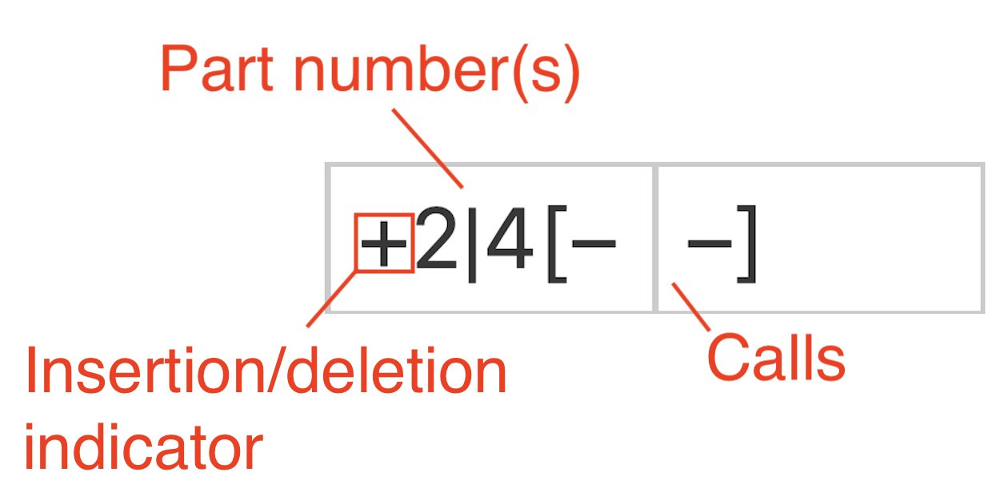
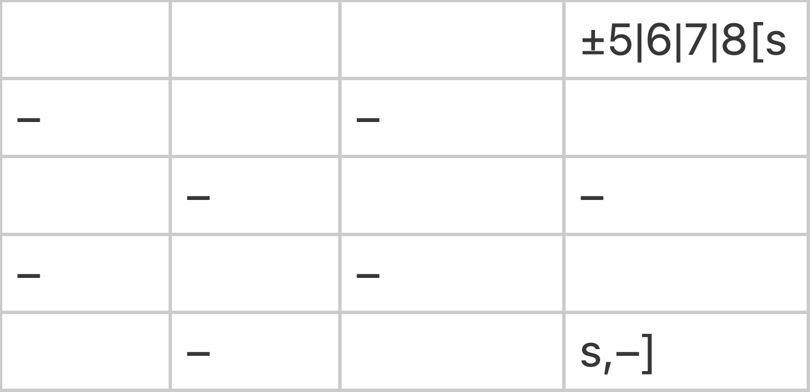
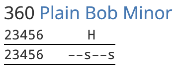
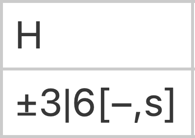
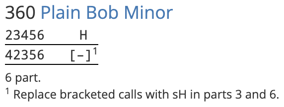
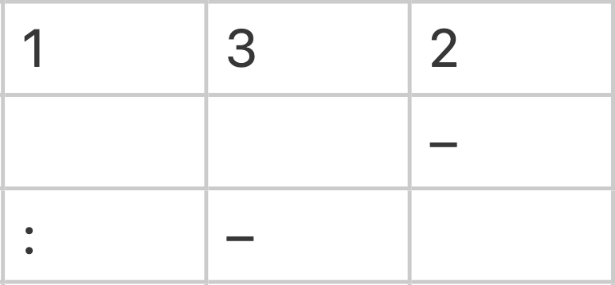
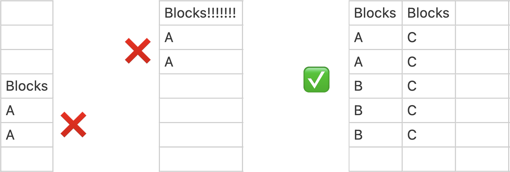
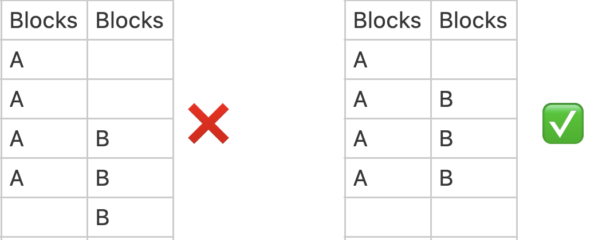
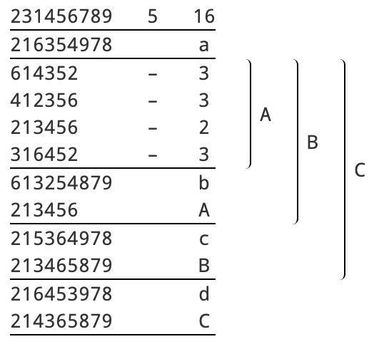

# The Calling tab

{width="400"}

The Calling tab is a spreadsheet in which the calling for a composition is defined. The calling specifies the sequence of calls (such as bobs and singles) which need to be made during a performance, including changes of method in Spliced.

!!! note
    In the explanation which follows, it will be assumed that you know how to read compositions. 
    
    If you are not already familiar with how compositions are typically laid out and interpreted, you should visit [How to read compositions](reading_compositions.md) before continuing.

## Editing the calling

To edit the calling, simply click on a cell in the table and type a value to enter it into that cell. 

Multiple cells can be selected by clicking and dragging. Alternatively, you can click on a cell, hold <kbd>Shift</kbd>, and then click on another cell to highlight a rectangle with those cells at opposite corners. Hold <kbd>Ctrl</kbd>/<kbd>⌘ Command</kbd> and click to select multiple individual cells.

<kbd>Backspace</kbd>/<kbd>Delete</kbd> will delete any values in selected cells.

Right-clicking on a cell will open a contextual menu, allowing you to manipulate the table by inserting or removing table rows and columns:

{width="300"}

### Copy-paste from other sources
In many instances you can save time by copy-pasting a calling from another source. This might be another web page, or a file on your computer.

With the calling highlighted in the source, <kbd>Ctrl</kbd>+<kbd>C</kbd> (<kbd>⌘ Command</kbd>+<kbd>C</kbd>) will copy. Then, in the Calling tab, select **a single cell** and press <kbd>Ctrl</kbd>+<kbd>V</kbd> (<kbd>⌘ Command</kbd>+<kbd>V</kbd>) to paste. 

The calling will be pasted into the table such that the selected cell is in its top left corner.

In many instances you will have to clean up the calling after copy-pasting, as the text formatting in the source can cause problems. Copy-pasting tends to work best if the original is in **plaintext format**, such as a composition attached to a performance on BellBoard.

## Anatomy of callings
Callings are entered into the Calling tab laid out by **courses**. If a composition was originally laid out by leads, you will need to reinterpret this into a course format as you enter it into the Calling tab.

!!! note "Callings versus Layout"
    It's important to remember that **a composition is defined by its calling**, but not by its layout or style of presentation. The same composition can be represented in many different ways. Indeed, Complib gives users [a lot of control](layout_options.md) over the way that any composition appears to them. 
    
    When defining a custom composition on Complib, the most important (and pretty much only) task is to correctly define the calling.

A typical composition, when entered into the Calling tab, might look like this:

{width="550"}

*Example: [5000 2-Spliced Bob Major](https://complib.org/composition/21029) by Edward W Martin*

Since you know [how to read compositions](reading_compositions.md), it should be clear from the above example that there is a direct correspondence between the way the calling is entered into the table and how it would normally be written when laid out by courses.

Some composition callings may not have all the features labelled here, while others may have more. The following sections contain information on all the calling features Complib supports and how to use them correctly.

## Calling positions
Calling positions are column headers which signal to Complib when a [call](#calls) in the table should occur.

**A calling position must be a single uppercase or lowercase letter [A–Z, a–z] or a positive whole number**.

**A calling position must be entered in the top row of a column, with nothing in any cell above it.** Failing to do this will cause the calling positions to be incorrectly identified as other objects, such as calls or named blocks.

!!! hint "Tip: Repeated calling positions"
    There is no restriction on the number of times that a given calling position appears. There are circumstances in which you may find it convenient to have the same calling position at the head of multiple columns in the Calling tab.

Compositions generally two types of calling position: [named positions](#named-calling-positions) (represented with letters), or [numbered positions](#numbered-calling-positions). While it's common to only use one type or the other in a given composition, you are free to use a mixture of both.

A special kind of named position, unique to Stedman Triples, is used in [twin-bob compositions](#twin-bob-calling-positions).

### Named calling positions
Named calling positions indicate that a call should be made when an **observation bell** reaches a specific part of the course. By default, the observation bell is the heaviest working bell.

Most compositions use a small number of well-known calling positions with special names, such as **H** (Home) and **W** (Wrong). Complib also uses these named calling positions by default. [See the dedicated page on calling positions](calling_positions.md) for a full list of the default positions and their names.

Custom named positions can be created by defining a new [Mnemonic](adding_compositions_tabs_calls.md/#mnemonic) and [Heading](adding_compositions_tabs_calls.md/#heading) in the [Calls tab](adding_compositions_tabs_calls.md). A different observation bell can also be specified using [observation masks](adding_compositions_tabs_calls.md/#observation-mask).

### Numbered calling positions
Numbered calling positions indicate a number of leads/divisions since the last **coursehead**.

When using numbered calling positions, you must provide additional information to Complib to allow it to count the leads/divisions correctly. If possible, you should specify appropriate [coursehead masks](adding_compositions_tabs_general.md/#coursehead-masks) in the General tab. You can also directly [control the length of courses](#manipulating-course-length-with-colons) in the Calling tab itself.

Since a course can be arbitrarily long, a numbered calling position can be any positive whole number. However, in practice it is very unusual to have courses requiring numbered calling positions with more than two digits. Bear in mind that anyone calling the composition has to count up to that number!

### Twin-bob calling positions
For historical reasons, many compositions of Stedman Triples use a special type of calling position which indicates **pairs of calls**. Such "twin-bob" compositions use four named calling positions, each of which is usually shortened to its initial letter:

> **S**low, **H**alf turn, **L**ast whole turn and **Q**uick.

The twin-bob calling positions correspond to numbered positions as follows:

|Position|Bobs at...|
|-----|--------|
|**S**| 3 and 4|
|**H**| 5 and 6|
|**L**| 7 and 8|
|**Q**| 12 and 13|

**When entering a twin-bob composition in the Calling tab, you should use numbered calling positions**. Complib will automatically recognise the twin-bob calling positions and display them appropriately in the composition layout (provided the user viewing it has [Layout Options > Rows > Expand twin bobs](layout_options.md/#rows) disabled in the [composition layout options](layout_options.md)).

## Calls
Calls such as bobs and singles are indicated by symbols and numbers in cells which are beneath [calling positions](#calling-positions). Multiple calls can be entered into the same cell, including calls of different types. 

**Calls are always processed in left-to-right reading order.**

The majority of compositions use a small set of standard call symbols. Accordingly, Complib has a standard set of [default call symbols](adding_compositions_tabs_calls.md/#bob) which it will interpret automatically. Any other symbols must be explicitly defined in the [Calls tab](adding_compositions_tabs_calls.md).

!!! warning "Defining custom calls"
    When defining a custom call in the Calls tab, remember that you must specify an [observation mask](adding_compositions_tabs_calls.md/#observation-mask), [Mnemonic](adding_compositions_tabs_calls.md/#mnemonic) and [Heading](adding_compositions_tabs_calls.md/#heading) for every **named calling position** at which that call occurs (it's not necessary to do this for numbered calling positions). 
    
    Symbols and calling position headings in the Calls tab should exactly match those in the calling, otherwise you will get a validation error.

### Multiple bobs
The [default bob](adding_compositions_tabs_calls.md/#bob) call is unique: it can be represented in the calling using numbers as well as the standard dash (–) symbol.

A positive whole number in a cell beneath a calling position will be interpreted to mean that many **consecutive** bobs at that calling position. In particular, the number 1 can be used as an alternative to the dash (–) symbol.

## Multipart compositions & call alterations
Many compositions have callings which are supposed to be repeated a number of times—these are known as **multipart** compositions.

When defining a multipart composition, you should enter the calling for the first part into the Calling tab, and indicate the [parthead(s)](adding_compositions_tabs_general.md/#partheads) under the [General tab](adding_compositions_tabs_general.md). This will prompt Complib to repeatedly apply the calling until rounds is reached.

Some multipart compositions require alterations to the calling in specific parts. The Calling tab has a robust syntax which allows you to specify these alterations, such as inserted or omitted calls, and even method substitutions in Spliced.

### Insertion and deletion
A basic call alteration looks something like this:

{width="400"}

Calls
:   The call or sequence of calls affected by an alteration is always enclosed in [square brackets]. 

    The opening and closing brackets do not have to be in the same cell, or even the same row. Pairs of brackets can even be nested inside each other. The only requirement is that every left [ bracket is paired with a corresponding right ] bracket later in the calling.

Part number(s)
:   Directly in front of the opening bracket are the numbers of any parts in which the alteration takes place. When multiple part numbers are listed, they should be separated by a pipe character ( **|** ).

Insertion/deletion indicator
:   Directly in front of the part number(s) is a symbol which indicates whether the calls in brackets are to be inserted (+) or deleted (-) in the numbered parts.

If entered correctly, the call alteration will be marked with a superscript number in the generated layout, with a corresponding footnote of the form:

> [*#*] Include/omit in part(s)...

### Call substitution
A more complex form of call alteration is a **call substitution**. This is when a call (or sequence of calls) is replaced with a different call (or sequence of calls) in a particular part.

A call substitution has the following form:

{width="400"}

Original calling
:   The call or sequence of calls to be replaced in the numbered parts. Separated from the substituted calling by a **comma**.

Substituted calling
:   The call or sequence of calls to be substituted in place of the original calling in the numbered parts.

Substitution indicator
:   A combination of the insertion and deletion indicators. Can be entered by typing both + and - (in either order) in front of the part number(s).

The original and substituted calling can be in the same cell, or spread across multiple cells and rows:

{width="400"}

The only requirement is that the parts of the syntax appear in their proper order when read left-to-right, top-to-bottom. In the above example, all nine calls between the left bracket and the comma are replaced by the lone bob to the right of the comma.

If entered correctly, the original calling will be marked with a superscript number in the generated layout, with a corresponding footnote of the form:

> [*#*] Replace bracketed calls with (substituted calling) in part(s)...

### Calling alterations and partheads
Be aware that if a calling alteration causes the next parthead to be different from what it would otherwise have been, you must make sure that the new parthead is included in the set generated by the [specified parthead(s)](adding_compositions_tabs_general.md/#partheads) under the [General tab](adding_compositions_tabs_general.md).

??? note "Example: Simple six-part"
    ---
    Consider this very simple touch of Plain Bob Minor:
    

    {width="200"}
    

    To turn it into a multi-part composition, we should identify the first parthead, which is 142356. Entering this into the General > Parthead(s) field will prompt Complib to expect a multipart calling. In the calling tab, we enter the first part only, with the required calling substitution in parts 3 and 6:
    

    {width="150"}
    

    Now we get an error:
    

    {width="400"}
    

    By looking at the generated layout, we can see the reason: Complib is still only expecting 3 parts, even though our calling indicates that there are 6. In the validation readout, Complib gives the generated partheads:

    > **Partheads: (3) 123456, 142356, 134256**

    This is too few. The partheads after the first single are missing. The fourth parthead in the touch, which would be 123456 without the calling substitution, is actually **124356**. Adding this parthead to General > Parthead(s) fixes the issue, and now the composition pricks correctly:
    

    {width="400"}
    

### Alterations affecting methods
The same syntax for call alterations also applies to any [methods](#methods) specified in the calling, allowing you to add, omit, or replace sequences of methods in certain parts.

## Calling repetitions 
There are many instances where it can be useful to repeat a section of the calling a set number of times. [Calls](#calls), [method sequences](#methods), and [named blocks](#named-blocks) can all be enclosed in ( round brackets ) with a number in front:

> ***n*( ... )**

This will prompt the pricker to repeat the calling inside the round brackets *n* times. **The brackets can span multiple cells**. The only requirement is that a left bracket must be paired with a corresponding right bracket.

??? note "Examples: Repetitions of calls, blocks and method sequences"
    ---
    

    {width="100"}

    Five consecutive bobs at **W**rong

    ---

    {width="200"}

    Single **H**ome, single **M**iddle, repeated 

    ---

    {width="100"}

    The [named block](#named-blocks) **B** called four times

    ---

    {width="150"}

    The [method](#methods) sequence **ABC** called twice
    

!!! warning 
    Calling repetitions are **written out in full** in the composition's layout display, regardless of the viewer's layout options. If you would to explicitly signal to the conductor that a section of the calling is used multiple times, consider using a [named block](#named-blocks) instead.
  
### Infinite repetition
A hash ( **#** ) symbol in place of a number indicates that the section in brackets should be repeated **indefinitely**. The pricker will continue this "infinite" repetition until the composition comes round (or runs false). 

**Only one infinite repetition can exist in the calling.** The calling before the repeated section will be processed as normal, but everything after it will be ignored.

A common use for infinite repetitions is in [compositions of Stedman](#infinite-repetition-in-compositions-of-stedman).

## Courses, courseheads, etc.
Courseheads and leadheads, while a key feature of many composition layouts, **are not entered into the Calling tab directly**. Instead, Complib derives them from the calling when it pricks the composition. 

The main way of signalling to Complib which rows should be considered courseheads in your composition is by entering appropriate [coursehead masks](adding_compositions_tabs_general.md/#coursehead-masks) under the [General tab](adding_compositions_tabs_general.md). However, some compositions use many different courseheads and require a large number of masks, some of which might not be known in advance. In such cases, it is often preferable to control the courseheads directly from the Calling tab.

### Manipulating course length with colons
A course can be forcibly ended at any point in the calling by inserting a colon ( **:** ) in a column headed by a **numbered calling position**. This signals to Complib that the next coursehead will come after a number of leads equal to the column heading.

??? note "Example: Colon in cell with a call."
    ---
    

    {width="200"}
    

    
    Entering the above into the Calling tab would produce a course which is 5 leads long, with a bob called at the end of lead 5 to bring up the coursehead.

Colons in the calling are processed just like calls, i.e. in reading order. However, **colons are not calls, and the two are processed independently of one another**. The first colon in the calling will set the length of the first course, regardless of any calls.

Similarly, a call appearing after a colon in reading order may nevertheless occur "before" it, if the calling position for the call is reached before the number of leads specified by the colon.

??? note "Example: Colon ignoring calls."
    

    {width="200"}
    

    Looking at the above example, you might think that the first bob occurs at the end of the second lead of the touch. However, the colon at position 1 sets the length of the first course to one lead **regardless of any calls**. This means that the first course ends after just one lead, before the call at 2 can be processed. 

    The bob at 2 occurs in the **second** course, at the end of the third lead of the touch. The bob at 3 happens at the end of the lead after that.

!!! warning "Colons: Things to watch out for"
    Colons are only valid at numbered calling positions
    :   Colons set a course's length equal to a number of leads. Inserting a colon at a named position (such as **H**) is not valid, and will cause an error.

    Colons disable coursehead masks
    :   If there are any colons in the calling, all [coursehead masks](adding_compositions_tabs_general.md/#coursehead-masks) will be disabled. 
    
        This means that colons are all-or-nothing: if you want to use a colon, then you must use them to specify the length of every course in the touch.
    
    Colons are not included in the layout
    :   Colons are a purely internal signal which forces Complib to behave a certain way. They are not rendered in a composition's layout, regardless of user settings.
    
        Similarly, if a calling position is used with colons to manipulate course length, but no calls ever occur there, then that calling position will not appear in the composition layout.

## Methods
Compositions which involve changes of method must indicate this in the Calling tab using the [method mnemonics](adding_compositions_tabs_methods.md/#mnemonic) defined in the [Methods tab](adding_compositions_tabs_methods.md).

Method mnemonics must appear in a column which has the word "**Methods**", and nothing else, in its top row. The heading is not case-sensitive: methods, METHODS and MeThOdS are all equally acceptable. There can be multiple Methods columns if desired.

{width="600"}

An **X** in the Methods column indicates a lead of the method whose mnemonic is X. 

**XXY** would indicate two leads of method X, followed by a change to method Y.

Method mnemonics are processed in reading order across all Method columns in the calling. When the last mnemonic in the calling has been processed, any additional leads will be pricked using the last indicated method. A touch which comes round at the end of multiple consecutive leads of method X only needs to specify mnemonics up to and including the final change to method X.

### Infinite repetition in compositions of Stedman
Compositions of Stedman, which define quick and slow sixes with separate mnemonics Q and S in the Methods tab, use an [indefinite repeat](#calling-repetitions) of **#(QS)** by default. This loop does not need to be included in the Calling tab. 

However, if a composition of Stedman starts from any row of a slow six, the implicit loop must be overriden with an explicit **#(SQ)** loop in the Calling tab.

!!! warning "Stedman in spliced"
    Because all changes of method after an infinite repeat are ignored, they cannot generally be used when Stedman is spliced with other methods. When entering the calling for such compositions, you must specify the sequence of alternating quick and slow sixes by hand. 

### Method alterations in multipart callings
Alterations to changes of method in multipart callings use the same syntax as for calls ([see above](#multipart-compositions-call-alterations)).

## Named blocks
Some compositions which do not reduce to a simple multipart calling nevertheless contain repeated sections, or **blocks**. For compactness, it can be useful to give a name to such a block which can stand in for its full calling.

To designate a section of the calling as a named block, the calling must have a column with the word "**Blocks**", and nothing else, in its top row. The heading is not case-sensitive, and there can be multiple Blocks columns.

{width="500"}

Entries in the Blocks column are **block names**. Block names can contain any number of upper and lowercase letters **[A–Z, a–z]**, but not numbers or other symbols.

If a table row contains a block name, the whole table row is included in a block with that name. Adjacent table rows are included in the same block if their block names are the same.

**Table rows can be included in multiple blocks at once**. This requires the use of multiple Blocks columns. If two blocks overlap, then **one of the blocks must be fully contained inside the other**.

{width="400"}

Once a block has been defined, the block name can be used in the calling in place of the contents of the block. Named blocks are expanded by the pricker when it reaches them in the calling. Like calls, blocks are processed in reading order. **Unlike calls, block names must occupy separate cells**.

A block can be called multiple times in a row by enclosing the block name in ( parentheses ) with the number of instances in front, or by entering the block name in multiple adjacent cells.

??? note "Example: A and B blocks"
    ---
    *Example: [5120 6-Spliced Surprise Major](https://complib.org/composition/10478) by Marcus C W Sherwood*.

    {width="600"}

    The above calling is reflected in the layout as:

    {width="500"}

??? note "Example: Nested A, B and C blocks"
    ---
    *Example: [10371 Stedman Caters](https://complib.org/composition/91069/) by Robert Dennis*.

    {width="600"}

    The above calling, which includes nested blocks, is reflected in the layout as:

    {width="400"}

    Notice that block A appears twice inside block B: in both explicit form and as its block name. Similarly, block B appears twice inside of block C.

!!! note
    You will not see named blocks in the composition layout if **Rows > Expand named blocks** is selected in your [layout options](layout_options.md).

## Troubleshooting
Coming soon... hopefully.