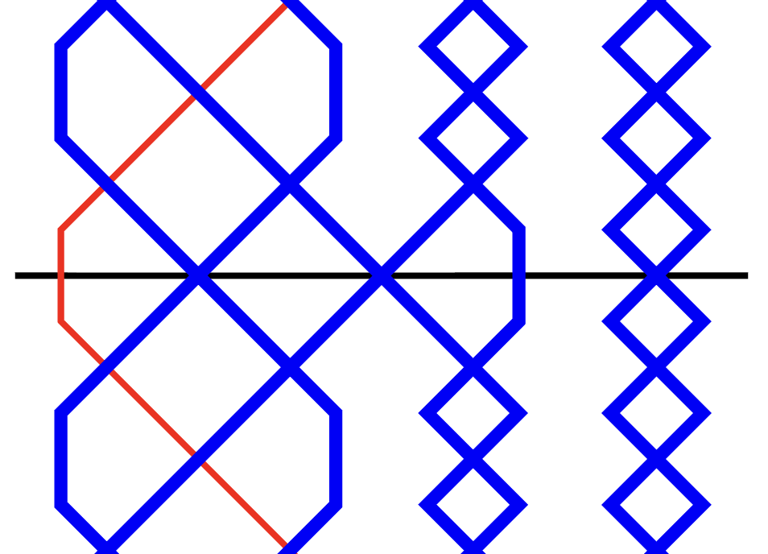
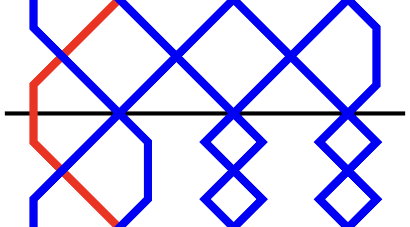
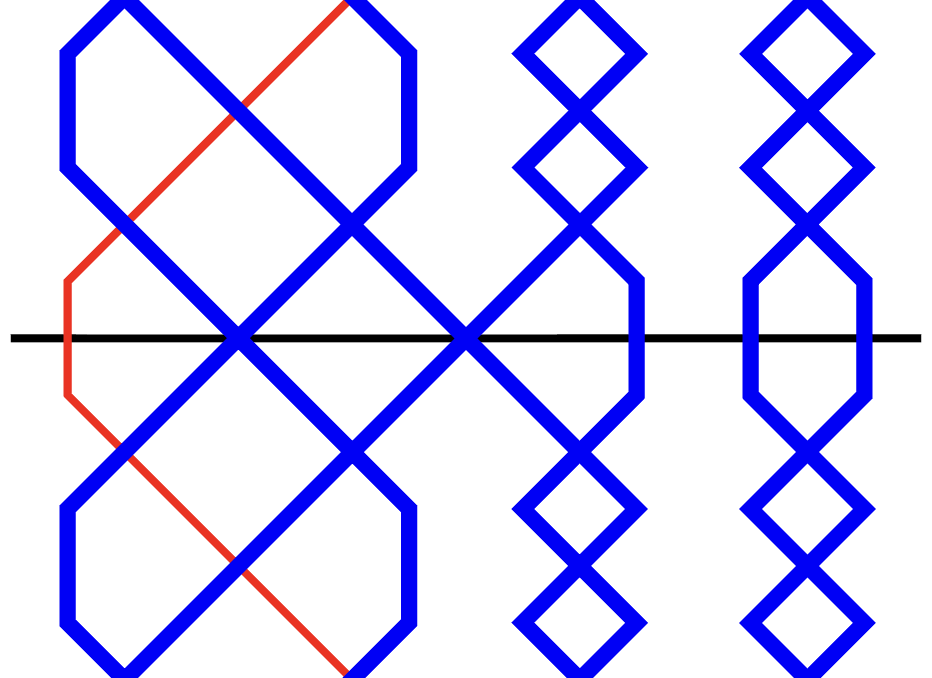
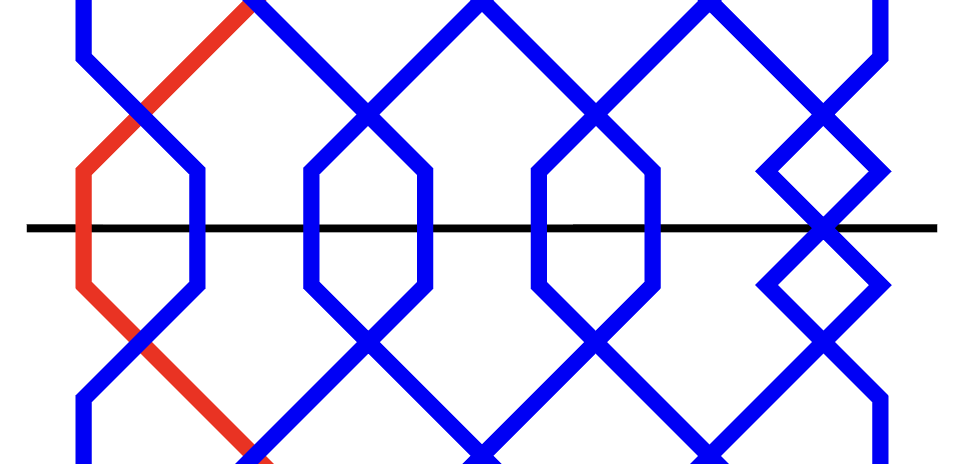

# The Calls tab

The Calls tab is a table which allows you to define any custom calls which are used in a composition.

To edit any value in the table, simply click on the relevant cell, then type a new value. Multiple cells can be highlighted by clicking and dragging. Alternatively, you can click on a cell, hold <kbd>Shift</kbd>, and then click on another cell.

!!! hint 
    Unlike the [Methods tab](adding_compositions_tabs_methods.md), you do not need to enter anything into the Calls tab in order to create a valid composition. This is because Complib has a number of default calls which account for the majority of those used in actual compositions.

    It's recommended that you leave the Calls tab empty unless your composition requires explicit call definitions. Complib will **automatically remove call definitions that it considers to be unnecessary** before any composition is saved.

## Call Type & Symbol
These fields determine which of a number of standard types the call falls under, and what symbol is used to represent it in the composition's [calling](adding_compositions_tabs_calling.md). 

Complib gives you the flexibility to define calls in whatever way you want. However, most compositions tend to use one of a small number of standard call types. These types (Bob, Single, etc.) are widely used, have commonly accepted meanings, and are often represented with a set of standard symbols. Others are rarer, and may have varied uses across different methods and composers. 

The default behaviour of some call types depend on the [default calls](../methods/method_properties.md/#miscellaneous) of the method(s) currently defined for the composition. However, since there is no need to define any of the default calls explicitly (and in fact Complib will remove any such extraneous definitions), the below examples are included more as a guide as to what each call type "usually" means.

A call symbol can be **any lowercase letter [a–z], or a dash (–)**, with the constraint that **all call symbols in a composition must be unique**.

The standard call types and their default symbols are:

### Bob
*Default symbol*: **–**

The simplest, most common type of call. In single-hunt methods and principles, a bob generally replaces a place made at/after the lead- or section-end with another made elsewhere in the row.

??? note "Example: Plain Bob, 4ths place bob"
    ---
    The diagrams below show the leadend of [Plain Bob Minor](https://complib.org/method/11349) with no call (top) and with a standard "near" bob (bottom). The bob replaces 2nds over the treble with 4ths over the treble.
    

    {width="200"}
    
    {width="200"}
    

??? note "Example: Double Norwich Court Bob Major, 6ths place bob"
    ---
    [Double Norwich Court Bob Major](https://complib.org/method/12470) with no call (top) and with a standard "far" bob (bottom). The bob replaces *n*ths place over the treble with (*n*–2)'s place over the treble.
    

    {width="200"}
    
    {width="200"}
    

    
??? note "Example: Stedman Triples, Stedman bob"
    ---
    The six-end of [Stedman Triples](https://complib.org/method/27985) with no call (top) and with a standard "Stedman" bob (bottom). The bob replaces *n*ths place over the six-end with (*n*–2)'s place over the six-end.
    

    {width="200"}
    
    {width="200"}
    

In twin-hunt methods, a bob generally replaces *n*ths place *before* the lead end with 3rds made *before* the lead end.

??? note "Example: Grandsire Triples, Grandsire bob"
    ---
    [Grandsire Triples](https://complib.org/method/12415) with no call and with a standard "Grandsire" bob. 
    

    {width="200"}
    
    {width="200"}
    

### Single
*Default symbol*: **s**

The second most common type of call. Singles are the counterparts to bobs, in the sense that they usually involve two extra places made in addition to the one(s) made at a standard bob.

??? note "Example: Plain Bob, 4ths place single"
    ---
    The diagram below shows the leadend of [Plain Bob Minor](https://complib.org/method/11349) with a standard "near" single. The single replaces 2nds over the treble with 2nds, 3rds and 4ths over the treble.
    

    {width="200"}
    

??? note "Example: Double Norwich Court Bob Major, 6ths place single"
    ---
    [Double Norwich Court Bob Major](https://complib.org/method/12470) with a standard "far" single. The single replaces *n*ths place over the treble with (*n*–2)'s, (*n*–1)'s and *n*ths place over the treble.
    

    {width="200"}
    

??? note "Example: Stedman Triples, Stedman single"
    ---
    The six-end of [Stedman Triples](https://complib.org/method/27985) with a standard "Stedman" single. The single replaces *n*ths place over the six-end with (*n*–2)'s, (*n*–1)'s and *n*ths place over the six-end.
    

    {width="200"}
    

??? note "Example: Grandsire Triples, Grandsire single"
    ---
    [Grandsire Triples](https://complib.org/method/12415) with a standard "Grandsire" single. Here, 2nds and 3rds are made over the treble at the leadend, in addition to the thirds made *before* the leadend.
    

    {width="200"}
    

### Plain
*Default symbol*: **p**

A utility call, used to prevent the pricker from inserting another call at the corresponding position. Plains should only ever be used to help Complib interpret a composition correctly: **plain calls are not displayed in the composition's layout**.

There are two cases in which the use of plain calls is required.

1. To force the pricker to ignore a calling position, to prevent the next call in the calling from being applied too soon. This quite often happens in compositions which specify calling positions by a number of leads after the course end.

    ??? note "Example: Grandsire Triples"
        ---
        

        {width="300"}
        

        [The above composition of Grandsire Triples](https://complib.org/composition/10835) begins with a single at 1. The next call is at 2 in the *following* course. However, naïvely putting a bob at 2 in the calling will cause Complib to wrongly insert the call immediately instead of waiting until the next course.

        To prevent this, the composition makes use of a plain call at 2 to force the pricker to wait until the next time the calling position is reached to apply the bob. The plain call is not displayed in the layout.

2. To prevent Complib from interpreting a **phantom parthead** as a true parthead. Phantom partheads are repeated parthead rows which need to be ignored in multi-extent compositions. In most cases, they are ignored automatically because Complib will not look for a parthead until all calls in a part have been used. 

    In the rare instance that a phantom parthead occurs between the last call and the true parthead, a plain call is needed to suppress it. In a few instances, it may be necessary to define a new calling position on the last row of the part.

    ??? note "Example: Erin Doubles"
        ---
        

        {width="250"}
        

        The above composition of Erin Doubles has 6 true partheads: 12345, 13245, 23145, 21345, 31245 and 32145. An Erin six which contains one of these partheads will also contain two of the others, so this composition has a large number of phantom partheads.

        Most of these are ignored, because there are calls remaining in the part. However, the six after the final single at 4 contains two phantom partheads in addition to the true parthead at the six end. The pricker will pick the first of these by default, which is incorrect. To prevent this, a plain call is inserted at 5 in the final course.

        By making [a clone of the composition](https://complib.org/composition/22327/copy) (NB: must be logged in) and examining the Calls and Methods tabs, we can see that a new Lead position of **LE** has been used to define a plain call at the six end. 
        
        Try deleting the plain at 5, and note the effect it has on the Blue Line display.

### Big Bob
*Default symbol*: **x**

Used by default to represent:
    
- Near calls:
    - A 6ths place bob for stages Royal and below;
    - A (*n*–4)'s place bob at stages above Royal.
- Far calls:
    - A (*n*–4)'s place bob.

### Big Single
*Default symbol*: *none*

Notionally a counterpart to the big bob. This call type has no default behaviour.

### Bob Single 
*Default symbol*: **b**

This rare call type takes its name from those used by John Holt in his landmark [10-part composition of Grandsire Triples](https://complib.org/composition/29040). By default, it represents:

- Near calls:
    - **1456** at even stages;
    - **1456*n*** at odd stages.
- Far calls:
    - **1(*n*****–4)(*****n*****–3)(*****n*****–2)** at even stages;
    - **(*n*–4)(*n*–3)(*n*–2)** at odd stages.

### Double
*Default symbol*: **d**

Generally used for a call which extends the standard single with two additional places made.

??? note "Example: Plain Bob Major with a 123456 double"
    ---
    [Plain Bob Major](https://complib.org/method/12834) with a standard double: 2nds, 3rds, 4ths, 5ths and 6ths are all made over the treble at the leadend.
    

    {width="200"}
    

By default, represents:

- Near calls:
    - **123456** at even stages;
    - **123456*n*** at odd stages.
- Far calls:
    - **1(*****n*****–4)...(*****n*****–1)*****n*** at even stages;
    - **(*****n*****–4)...(*****n*****–1)*****n*** at odd stages.

### Extreme 
*Default symbol*: **e**

By default, represents **125** in Doubles. Has no default behaviour at other stages.

### Omit 
*Default symbol*: **o**

By default, represents **1** in Doubles. Has no default behaviour at other stages.

### Trim 
*Default symbol*: **t**

Used to indicate a call which often (but not always) changes the length of a lead. Usually a trim will **skips changes** within a method's lead, or substitutes some of the method's changes with a shorter sequence. Requires a [Changes replaced](#changes-replaced) value to be specified.

### Fill 
*Default symbol*: **f**

Used to indicate a call which often (but not always) changes the length of a lead. Usually a fill **inserts extra changes** within a lead, or substitutes some of the method's original changes with a longer sequence. Requires a [Changes replaced](#changes-replaced) value to be specified.

### Jump 
*Default symbol*: *none*

This call type must be used if the call involves Jump changes and uses [Jump place notation](../methods/place_notation.md/#jump-changes).

### Special 
*Default symbol*: *none*

## Notation
The [place notation](../methods/place_notation.md) of the call. If the call affects multiple changes, the notation will have multiple elements.

## Changes replaced
This value is only used with the [trim](#trim) and [fill](#fill) call types, in order to specify how many changes (if any) are to be replaced with the change(s) in the [Notation](#notation) column.

If a lead originally has length *L*, and a trim or fill call changes that length to *M* by inserting or substituting a sequence of *N* changes, then:
> Changes replaced = *L* – *M* + *N*

All values in the above equation must be positive. **This means that for fill calls, where *M* ≥ *L*, the Changes replaced value must be less than or equal to *N*.**

??? note "Examples: Fills and trims"
    ---
    Click on the names of the example compositions below to open them directly in the composition editor so that you can see how the submitter has defined the calls (NB: must be logged in).

    Fills
    :   [5040 Kent Treble Bob Royal](https://complib.org/composition/79358/copy) by John Reeves

    Trims
    :   [5099 Compton Castle Surprise Major](https://complib.org/composition/79359/copy) by Robert D S Brown

        [5000 41-Spliced Surprise Minor](https://complib.org/composition/79371/copy) by Alexander E Holroyd

## Lead position name
The unique identifier for a Lead position at which the call can occur. This can be anything you want, so long as it exactly matches a corresponding [Methods > Lead position name](adding_compositions_tabs_methods.md/#lead-position-row-number-and-name) entry under the [Methods tab](adding_compositions_tabs_methods.md).

The Lead position name will appear in the composition's [layout](overview.md/#layout) as part of a custom call definition. However, if the call uses the **LE** Lead position name (see below), this will be omitted from the layout.

### Default Lead positions
Many of the default call types have a default Lead position name which they use. Since they correspond to common calling positions, you may wish to use them even when definining custom calls. The common ones are:

LE
:   Short for "lead end". Used by default for: 
    
    - Near/far/Grandsire bobs and singles;
    - Plains;
    - Big bobs and big singles;
    - Bob singles;
    - Doubles and extremes.

    This calling position, being by far the most commonly used, will **not** be explicitly named in the composition's layout as part of the call's definition.

SE
:   Short for "section end". This is used for Stedman-type bobs and singles by default. 

HL
:   Short for "half lead". Used for trims and fills by default.

## Mnemonic

## Heading
Only used when defining a custom calling position, or when specifying an observation bell which is not the highest numbered bell. 

The heading must be a single uppercase or lowercase letter [**A–Z, a–z**], or left blank. The heading value is used as a column heading for the corresponding calling position in the composition [layout](overview.md/#layout) when laid out by courses; the heading is inserted after the call's [symbol](#call-type-symbol) in the layout when laid out by leads, or when a calling alteration is given.

The heading used should exactly match a calling position heading used under the [Calling tab](adding_compositions_tabs_calling.md). 

## Observation mask
Only used when defining a custom calling position, or when specifying an observation bell which is not the highest numbered bell.

An observation mask is a [**row mask**](adding_compositions_tabs_general.md/#what-is-a-row-mask) which gives the position of the observation bell *after* the call is made at the calling position indicated by the [Heading](#heading) value.

??? note "Example: 2nd as observation"
    ---
    

    {width="250"}
    

    In this composition of Yorkshire Surprise Royal, the 2nd is the observation bell: all the calls are made in reference to its position, rather than that of the tenor. To achieve this, observation masks have been specified for all the calling positions used. These can be seen under the Calls tab by opening a [clone of the composition](https://complib.org/composition/123109/copy) (NB: must be logged in):

    

    {width="500"}
    

    Each observation mask specifies the position of bell 2 *after* the call at the corresponding calling position. All other bells are represented using wildcards (**x**).

## Further examples
For more examples of compositions using the Calls tab, [see the Examples reference collection](https://complib.org/collection/10184/?chapter=Calls%20and%20Calling%20Positions). Click on a composition in the collection, then click {width="25"}**Clone** to duplicate it in the composition editor. Navigating to the Calls tab will give you a peek at how the submitter has defined the calls in their composition.