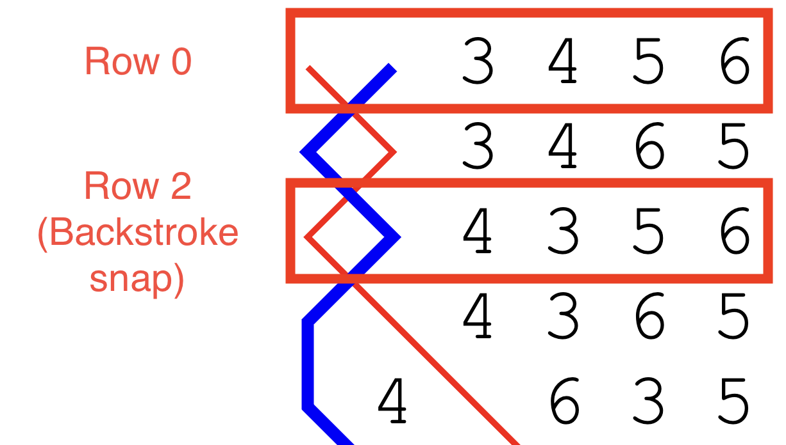

# The General tab
The General tab allows you to specify various high-level properties of a custom composition. When creating a new custom composition, this is usually the tab that you will use first.

Complib will attempt to infer as much information as it can about a composition based on data you have already entered. In particular, several fields in the General tab will **automatically update** other tabs when populated. This can save a lot of time when defining a custom composition.

The sections on this page describe the entry fields on the General tab in detail. [Validation errors](adding_compositions_overview.md/#validation-errors) and [warnings](adding_compositions_overview.md/#validation-warnings) specific to fields in the General tab are listed at the end of the section pertaining to that field.

## Title
This field specifies the user-defined title of the composition. This is different from the **generated title**, which is provided automatically by Complib upon validation. The user-defined title is how the composition will be referred to elsewhere in the Composition Library once it is published, such as on the home page or in search results. 

The user-defined title can be anything you want: Complib has full Unicode support, so there's nothing to stop you from using titles like "❤️❤️❤️❤️" or "五千四十 B̶͇̊̈́̈r̸̰̈́ī̵̙s̵͈̙̰͆͆͘ť̵̝̉o̶̦͔͌͆͝l̶̜̊ ̸̻͕̰͋̃́Ş̷͛̅u̶̞͚̞̇̽͠r̶̹͉͉̈́͛̈́p̶͉̆r̸͙̼̰̐͆͝i̴̛͕͒s̷̪̻̈́͝e̴͔͗̓͜ ̵̨̛̻̀M̸̧̜͕͐̃a̷̠̼̞̓̀j̸̱̀̏͛ö̴͙̝́͂r̶̨̮̲̎"  if you really want to. However, if you intend to publish the composition, it is best practice to use a title which corresponds closely to the generated title. This makes it easier for others to identify important information about your composition at a glance. 

The generated title formats are:

- **Length + Method name + Class + Stage**, for single-method compositions;
- **Length + (# of methods)-Spliced + Class + Stage**, for spliced-compositions at a single stage;
- **Length + (# of methods)-Spliced + Stage 1 and Stage 2**, for mixed-stage compositions.

Complib will use the user-defined title to automatically populate certain other data fields if possible. This is another good reason to match the style of generated titles. The other fields which Complib will attempt to infer from the title are:

-   [Stage](#stage)
-   [Method](adding_compositions_tabs_methods.md) (for compositions which are recognised to be for a single method)

### Title warnings and errors

??? warning "Warning: Does not start with the pricked length."
    ---

    The title provided does not start with a number which matches the length of the composition as pricked by Complib. With rare exceptions, composition titles begin with their length.

??? warning "Warning: Does not match pricked method."
    ---

    The title provided does not contain the full name of the method which is being used to generate the composition's rows. With rare exceptions, you should aim for these to match.

## Opus
This field allows you to specify an Opus for the composition. Some composers use an Opus to help distinguish between compositions which might otherwise have the same title, or to highlight a notable feature of the composition. Some example compositions using an Opus are: 

-   [5088 Bristol Surprise Major Op. 4](https://complib.org/composition/11538) by Donald F Morrison;
-   [5016 6-Spliced Maximus Op. Classic](https://complib.org/composition/12496) by David J Pipe;
-   [5014 Stedman Cinques Op. Bobs only](https://complib.org/composition/75325) by Mark R Eccleston.

Text entered in the Opus field will be automatically appended to the end of the composition's title whenever it is referenced elsewhere in the Composition Library. For this reason, there is no need to include it in the [Title](#title). The Opus text will be listed in the form **Op. [text]**.

## Stage
This field is a drop-down menu which allows you to select the stage the composition is designed for. For mixed-stage compositions, this should be the highest numbered stage.

The stage of a composition indicates how many bells are being rung. Many stages have historical names which must be learned. The table below gives the names for every stage at which Complib can accept compositions.

| *N* | Stage name |   | *N* | Stage name |   | *N* | Stage name | 
|-----|------------|---|-----|------------|---|-----|------------|
| 2   | Two        |   | 13  | Sextuples  |   | 24  |Twenty-four |
| 3   | Singles    |   | 14  | Fourteen   |   | 25  |Twenty-five |
| 4   | Minimus    |   | 15  | Septuples  |   | 26  |Twenty-six  |
| 5   | Doubles    |   | 16  | Sixteen    |   | 27  |Twenty-seven|
| 6   | Minor      |   | 17  | Octuples   |   | 28  |Twenty-eight|
| 7   | Triples    |   | 18  | Eighteen   |   |
| 8   | Major      |   | 19  | Nonuples   |   |
| 9   | Caters     |   | 20  | Twenty     |   |
| 10  | Royal      |   | 21  | Decuples   |   |
| 11  | Cinques    |   | 22  | Twenty-two |   |
| 12  | Maximus    |   | 23  | Twenty-three | |

### Stage warnings and errors

??? warning "Warning: is not the same as stage in Title"
    ---

    The stage specified does not match the stage name in the [Title](#title) field. In almost all cases these should be the same. 
    
    The warning will also be displayed if: 

    - No stage name is included in the Title field; or
    - The Title field contains **multiple stage names**, even if one of them matches the stage specified. 
    
    An exception to this last point is where exactly two stage names are used with the word "and" between them, and one of these matches the stage specified. In this case the composition is interpreted as being **mixed-stage**.

## Composer details
This field allows you to list the names of people or other named entities (such as computer programs) which were involved in creating a composition.

To add an attribution to the composition, click on **Add composer**. This will create a new attribution, which has two parts: an **attribution type** and a **name field**.

{width="500"}

To delete an attribution, click the {width="20"} cross to the right of the name field.

!!! warning "Warning: adding multiple attributions"
    **You should only ever add one composer name per attribution**. If you want to attribute the composition to multiple people, you must add them separately by clicking **Add composer** to bring up additional attribution fields.
    
    You should generally avoid attributing a composition to the same person in multiple different ways (see [Attributions in search results, etc.](#attributions-in-search-results-etc)).

### Composer name
This is a text field in which you can enter the name of the person or entity which you wish to attribute. Complib will attempt to auto-complete the name using all the registered composer names in its database. Clicking on a composer's name in the drop-down list will add that name to the text field.

!!! warning "Warning: Composer names"
    **You should not add anything to the Composer name field other than a person's name**. Similarly, you should exercise great care when entering a composer's name, as any mistakes will be reflected in Complib's Report data and will have to be corrected manually.

    If the name you enter does not match an existing composer, then saving the composition will create a new composer page under that name. **You should make sure that the name is listed correctly before saving or publishing a composition attributed to a new composer.**

### Attribution type
This field is a drop-down menu which allows you to further specify the kind of attribution you want to make. These attribution types do not have set definitions, and to some extent they are open to interpretation. However, most have commonly accepted meanings. 

When submitting a composition which was produced by someone else, you should use an attribution type which corresponds with their wishes whenever possible.

The types of attribution are:

Composed by
:   The most common type of attribution. Used to identify the person or entity primarily responsible for creating the composition. 

Jointly composed by
:   For cases in which a team of people were jointly responsible for creating the composition. You should add one attribution of this type for each person you wish to jointly attribute the composition to.

Arranged by
:   Generally used in cases where the composer considers the composition to be an arrangement of one previously published.

Generated by
:   Used to identify a computer program which was responsible for producing the composition.

Selected by
:   Generally used to identify someone who chose the composition from a set generated by a computer program.

After
:   Used to identify another composer who inspired the composition. As opposed to **Inspired by**, this usually means that a particular stylistic feature or prior composition is being imitated in some way.

Inspired by
:   Used to identify another composer who inspired the composition.

Also attributed to
:   Generally used to identify other composers who have previously been credited with producing the composition.

### Attribution ordering
There is an implicit order of priority between the attribute types, given by the order in which they appear in the drop-down menu. This determines the order in which attributions are listed on the composition's page as part of its [layout](overview.md/#layout).

If multiple names have the same attribution type, they will be listed on the same line in lexicographical order.

### Attributions in search results, etc.
When a composition appears in search results, or in certain other places such as the Recently Published section, all its attributions will be listed after the composition's title in the format: 

[Title] by [Name 1], [Name 2], ... , and [Name *N*]. 

Complib will **not** identify whether any of the listed names are identical, which means that the same name may appear multiple times. For this reason, you should generally avoid attributing a composition to the same person in multiple different ways.

### Attribution warnings and errors
??? warning "Warning: [Name] will be added as a new composer."
    ---

    The entered name does not match any existing composer in Complib's database. Saving the composition will create a new composer page with the same name as the attribution. **You should only make an attribution using a new name if the name does not appear in the drop-down list**.

    You should also make sure that the name is listed correctly before saving or publishing a composition attributed to a new composer.

## Year, month or date composed
This field lets you specify a year, month or date when the composition was composed. Dates are given in the format **[Day][Month][Year]** and will appear in the composition's [properties tab](composition_properties.md/#miscellaneous).

It's not necessary to specify a full date, as often it is either not known or unnecessarily specific. For example, you might want to record the date as a month and year (e.g. **Feb 2003**), or simply a year (e.g. **1987**).

There are a number of different ways a year, month or date can be entered. The following are all equivalent ways of entering the same date:

-   1/1/10
-   1-1-2010
-   01/01/2010
-   1 Jan 2010
-   1 January 2010

### Year
The year can be given as either a two- or four-digit number. 

If a two-digit number is used, it is assumed to represent a year in the present century, unless that date would be in the future, in which case it is assumed to be in the previous century.

### Month
The month can be entered as a one- or two-digit number, or as a short or long month name. 

If a month is specified, but no year, then the year will be assumed to be the same as the current year in Local Time.

### Day
The day can be entered as a one- or two-digit number.

### Date warnings and errors
??? danger "Error: `____` is invalid."
    ---

    The text entered in the date field does not match any accepted date format. You should use one of the formats described above.

??? danger "Error: `____` is before 1650."
    ---

    Composition dates must fall after 1650, as the earliest known method, Grandsire, dates to around then. 
    
    If you have good reason to believe you are in possession of a composition dating from before 1650, you should immediately notify the Central Council (as well as anyone else who will listen).

??? danger "Error: `____` is in the future."
    ---

    Composition dates must be in the past with respect to the present date in Local Time.

    If you have good reason to believe you are in possession of a composition originating from the future, you should immediately seek medical attention.

## Parthead(s)
This field allows you to specify one or more partheads. In a composition that has multiple parts, a parthead is the **first row** of one of the parts. 

Partheads must be valid rows, and must match the currently specified [stage](#stage). If more than one parthead is entered, they must be separated by commas (`,`).

Complib will use any specified partheads to generate a set of partheads. The size of this set depends on the partheads themselves, as well as the order in which they are entered. Specifically, Complib generates the set of partheads by repeatedly transposing any defined parthead by itself, and by any which were defined *before* it.

??? note "Example: Parthead 135264"
    ---
    Suppose that your composition uses the parthead 135264. Complib will repeatedly apply the transposition implied by this parthead to obtain the additional partheads 156342, 164523 and 142635. These generated partheads do not themselves generate any new partheads, so these four partheads (together with rounds) form a closed set.

??? note "Example: Partheads 123465, 123645"
    ---
    Partheads 123465 and 123645 together will generate a set of six partheads: 123465, 123645, 123546, 123654, 123564 and 123456.
    The same set will be generated regardless of the ordering of the two specified partheads.

It is important to bear in mind that the ordering of the custom partheads can change the resulting set of generated partheads. The next example demonstrates this.

??? note "Example: Partheads 123564, 124536"
    ---
    The two partheads 123564 and 124536 will produce a total of nine generated partheads. However, the members of those sets depends on which order the two given partheads are specified in.

    123564, 124536:

    > 123456, 123564, 123645, 124536, 124365, **124653**, 125346, **125463**, 125634

    124536, 123564:

    > 123456, 124536, 125346, 123564, 125634, **126354**, 123645, **126435**, 124365

    It can be seen by inspection that the **bolded** partheads are not shared between the two sets.

Any generated partheads will be listed in the validation readout, with the user-specified parthead(s) highlighted in grey. You should use this to check that Complib is correctly identifying the partheads used in the composition.

### Non-transposing partheads
In some cases, it can be difficult to work out the correct ordering of partheads. There are also some cases in which a generated parthead will not appear in the composition despite being implied by other partheads—for example, a composition might make use of an [omit](adding_compositions_tabs_calls.md/#omit) to skip one of the partheads.

If this is causing problems, you can specify that a parthead provided to Complib should *not* be used to generate additional partheads. This is done by putting a plus (+) at the front of the parthead.

??? note "Example: 13425678, +12436578"
    ---
    Normally, the partheads 13425678 and 12436578 together would generate a set of six partheads. However, if the second of these is made a non-transposing parthead, +12436578, then the set generated is:

    13425678, 14235678, 12345678, 12436578

    It can be seen that 13425678 has only been used to transpose itself, and that 12436578 has been left as-is.

### Partheads and mid-lead starts/finishes
It is important that the partheads provided to Complib are the actual partheads of the composition. Particular care should be taken when a multipart composition uses a mid-lead start/finish, such as in many multipart compositions of Stedman. 

In such compositions, **the parthead rows typically occur in the middle of a lead/division**—they are not simply the nearest lead- or section-end, as is sometimes used for convenience when writing a composition down by hand.

??? note "Example: Multipart beginning at the backstroke snap"
    ---
    [5056 Bristol Surprise Major](https://complib.org/composition/51258), Op. 3 (rotated) by Alan G Reading is a two-part composition of [Bristol Surprise Major](https://complib.org/method/19048) which begins at the backstroke snap, or row 2 in the lead. 
    
    The leadhead row closest to the partend is 12437586, but the true parthead, 12435678, occurs two changes later. It is this true parthead which the composition must specify. By [opening a clone of the composition](https://complib.org/composition/51258/copy) (NB: must be logged in) we can see that 12435678 is indeed the parthead used.

### Parthead warnings and errors

??? danger "Error: must be a valid row of the same length as the stage"
    ---

    This error is encountered if any parthead is an **invalid row**, or if the stage of the composition and the stage of the specified parthead(s) do not match.

    Valid row
    :   A valid row contains the numbers 1 to *N*, where *N* is determined by the [specified stage](#stage). It must contain each number **exactly once**.

    Too many/too few commas
    :   If the stages match and the partheads are all valid rows, but you are still seeing the error, it may be because the Parthead(s) field contains too many or too few commas. 
        
        Specified partheads must be separated by commas, or Complib will interpret them as being part of the same row. 
        
        Extra commas will prompt Complib to expect additional parthead(s): if it cannot find any, it will interpret this as a parthead of stage zero, which will not match the specified stage.

??? danger "Error: The number of partheads specified is `___` but the composition as pricked only contains `___` of them."
    ---

    Complib will check whether all generated partheads are included among the pricked rows of the composition. If any are missing, then there is a mismatch between the implied multi-part structure and the actual composition. There are two main causes for this error:
    
    Incorrect calling
    :   There is a mistake in the specified [calling](adding_compositions_tabs_calling.md) which is preventing the composition from reaching an implied parthead;

    Incorrect parthead(s)
    :   The partheads are all valid rows, but one or more of them have been entered incorrectly. As a consequence, the generated parthead(s) do not match the intended ones. You should check that any partheads entered in this field exactly match the expected partheads of the composition.

        If the number of generated partheads in the validation readout does not match the number of parts you expect the composition to have, then this is a sign that one or more of them has been entered incorrectly.

## Coursehead mask(s)
This field allows you to specify coursehead masks, which are used by Complib when formatting the composition's [layout](overview.md/#layout). Coursehead masks should be at the same [stage](#stage) as the composition, and must be separated by commas (`,`).

### What are courseheads?
A coursehead is a starting row of a lead/division which is also the first row of a course.

When a composition is [laid out by courses](layout_options.md/#lay-out-composition-by), the courseheads will be displayed in the leftmost column (provided [Columns > Coursehead](layout_options.md/#columns) is enabled in the composition layout options):

{width="400"}

When the composition is laid out by leads and [Rows > Show all leadheads](layout_options.md/#rows) is enabled, horizontal lines are ruled under each coursehead:

{width="300"}

Most of the time, Complib is able to infer the intended courseheads. However, if your composition uses unusual courseheads, or courses of non-standard lengths, you may need to specify the courseheads you want displayed.

!!! warning 
    If your composition specifies call positions by a number of leads after the course end, Complib needs to have courseheads provided to it in order to count the leads properly. 
    
    Additionally, if a composition has multiple parts, **you must remember to provide appropriate coursehead masks for all the parts**.

Manually specifying all courseheads in a composition can be time-consuming and prone to mistakes. To avoid this, Complib allows you to use **row masks**.

### What is a row mask?
A row mask takes the form of a valid row at the composition's specified [stage](#stage). However, unlike a normal row, a mask can include **wildcards** which represent any bell not named elsewhere in the row. Wildcards are denoted with an `x` in place of a bell number. 

??? note "Examples"
    ---

    The following table gives some examples of row masks, together with the rows which match them.

    | Row mask | Matching rows | Total matches|
    |------|---------------|--------------|
    | 54321 | 54321 | 1 |
    | 1xxx56 | 1**234**56, 1**324**56, 1**342**56, 1**432**56, 1**423**56, 1**243**56| 6 |
    | xxxx2468 | **1357**2468, **3157**2468, **3517**2468, ... , **7531**2468 | 24 |
    | xxxxxx7890E | **123456**7890E, **213456**7890E,  ... , **654321**7890E | 720 |

    It can be seen that row masks are an efficient way of specifying a large number of potential rows at once. A mask with *n* wildcards matches *n!* different rows.

### How Complib selects courseheads
A row will be selected as a coursehead and included in the [composition layout](overview.md/#layout) if the following hold:

-   The row belongs to any course reached during the composition; **and**
-   The row is a leadhead; **and**
-   The row matches any of the specified coursehead masks.

If a coursehead satisfies these conditions but is not actually rung during the course to which it belongs, it will be included in the layout (in parentheses).

### Default coursehead masks
All compositions must have at least one coursehead mask. If you do not provide one, Complib will automatically infer a coursehead mask based on the composition's specified [stage](#stage). The default coursehead mask will generally be of the form x...xN, where *N* is the largest numbered bell at the composition's specified stage.

### Missing courseheads
If there are courses in the composition which do not contain rows matching any coursehead mask, then:

-   The course will be displayed without a coursehead (for compositions [laid out by courses](layout_options.md/#lay-out-composition-by));
-   No horizontal line will be drawn underneath that course (for compositions laid out by leads with [Rows > Show all leadheads](layout_options.md/#rows) enabled).

### Coursehead mask warnings and errors
??? danger "Error: must be a valid row mask of the same length as the stage."
    ---

    This error is encountered if any coursehead mask is an **invalid row mask**, or if the stage of the composition and the stage of a coursehead mask do not match.

    Valid row mask
    :   A valid row mask contains exactly *N* characters, where *N* is determined by the composition's [specified stage](#stage). The row mask must contain the numbers 1 to *N* **at most once**, with any missing numbers replaced by wildcards (`x`).

    Too many/too few commas
    :   If the stages match and the coursehead masks are all valid, but you are still seeing the error, it may be because the Coursehead mask(s) field contains too many or too few commas. 
        
        Coursehead masks must be separated by commas, otherwise Complib will interpret them as being part of the same mask. 
        
        Extra commas will prompt Complib to expect additional coursehead mask(s): if it cannot find any, it will interpret this as a coursehead mask of stage zero, which will not match the specified stage.

## Start row number
Allows you to specify which row of the first [specified method](adding_compositions_tabs_methods.md) the composition starts from. Most compositions are rung starting from row 0.

If no start row number is specified, the field defaults to a value of 0. 

If the start row number is anything other than 0, the starting row will be noted underneath the calling in the [composition layout](overview.md/#layout). The exceptions are compositions which [begin at the treble's backstroke snap](#starting-at-the-backstroke-snap), and certain compositions of [Stedman](#starting-rows-in-compositions-of-stedman).

### Starting at the backstroke snap
A large proportion of compositions with a non-zero starting row are compositions of treble-dodging methods which begin from the treble's **backstroke snap**. The example below shows the first few rows of [Kent Treble Bob Minor](https://complib.org/method/26082), with the backstroke snap labelled.

{width="400"}

If a composition begins with a treble-dodging method, and has a starting row number of 2, then **"Start at the backstroke snap"** will be appended to the composition layout.

### Starting rows in compositions of Stedman
For historical reasons, touches of Stedman at any stage are usually rung starting from **row 4**. For this reason, compositions of Stedman starting from row 4 do not have a starting row appended to their layouts.

When a starting row is appended to the layout of a composition of Stedman, it will have a unique format: **"Start with rounds as the [...] row of a [slow/quick] six."**

### Starting row warnings and errors
??? danger "Error: `___` must be a positive integer or zero (the default)"
    ---

    Starting row numbers must be greater than or equal to zero. If you encounter this error, it is because you have entered a number which is negative (for whatever reason). 

??? danger "Error: A method definition's length, its start row number and/or the composition start row number are out of bounds of the method's place notation."
    ---

    This error can be caused by setting a starting row number which is larger than the lead length of the starting method.

    If changing the starting row number does not clear the error, it may be because a method has been incorrectly configured in the [Methods tab](adding_compositions_tabs_methods.md).

## Backstroke start
While most compositions are started at handstroke, some compositions are designed to be started at backstroke. You should enable this field if you want to indicate that your custom composition is to be started at backstroke.

When enabled, a supplementary note will be added to the composition's layout which reads **"Start at backstroke."** Any additional instructions relating to how the composition starts (such as a specific [starting row](#start-row-number)) will be appended to this.

!!! warning
    Forgetting to set this option may result in the composition's [blue line](overview.md/#blue-line) being displayed incorrectly when [Column display > Show handstroke/backstroke](../methods/blueline_options.md/#column-display-options) is enabled. Similarly, stroke-specific properties of the composition such as [Changes > Tenors reversed](composition_properties.md/#changes) may not be listed accurately. 

    It may also lead to errors in the calculated [Music score](overview.md/#music-score), e.g. when accounting for handstroke and backstroke wraps, or when using a half-muffled music scheme (see [Music schemes](../advanced/music_schemes.md) for more on this).

    For the benefit of conductors who might want to ring your composition, please remember to set this option if appropriate!

## Extents
This field is used to signal to Complib the number of complete and partial extents the composition contains. If this field is left blank, Complib will infer the number of extents from the composition's [Title](#title) and [Stage](#stage) if it can. Otherwise, it will default to a value of 1.

Complib uses the Extents value to determine how many times the composition is expected to return to rounds, as well as the maximum allowable repetitions of a given row before the composition runs false.

If the Extents value is set too small, there may sections of the composition which are ignored because the composition comes round before that point is reached, or because the maximum number of false rows is been reached.

## Default calls
This field is a dropdown menu, from which you can select a default call type for the composition. This will determine the way that standard call symbols such as `-` and `s` are interpreted in the composition's [calling](adding_compositions_tabs_calling.md). It will also determine the default behaviour of entries in the [Calls tab](adding_compositions_tabs_calls.md).

This field may autofill with a certain value depending on which [calling positions](calling_positions.md) have been used in the composition's [Calling tab](adding_compositions_tabs_calling.md), and which method is defined in the [Methods tab](adding_compositions_tabs_methods.md).

The default call types are: 

Near
:   Calls will default towards the front of the change. Standard bobs and singles will be assumed to be 4ths-place calls unless otherwise specified in the Calls tab.

Far
:   Calls will default towards the back of the change. Standard bobs and singles will be assumed to be (*N*-2)ths-place calls unless otherwise specified in the Calls tab.

Grandsire
:   Calls will be assumed to represent Grandsire-type calls appropriate to the composition's stage. This call type is normally only used in compositions of twin-hunt methods such as Grandsire and Single Oxford, or in Doubles variations like April Day.

Stedman
:   Calls will be assumed to represent Stedman-type calls appropriate to the composition's stage. This call type is normally only used in compositions of Stedman and Erin.

None
:   Calls will not default to any particular type. If this call type is selected, then all calls used in the calling must be manually defined in the Calls tab. You should use this call type to signal to the conductor that the composition uses calls which fall outside any of the standard types.

## Notes
This field allows you to provide additional notes to accompany the composition. For instance, this could be a piece of historical information, some interesting feature of the composition, or your favourite recipe for parsnip soup. 

The text entered in this field will be displayed in the [Library details tab](overview.md/#library-details) on the composition's page.

!!! warning 
    The Notes field has a character limit of 1000. Entries longer than this will be truncated.

## Allow save if false
The vast majority of compositions that change ringers use are true (i.e., not false). See [Composition properties > Truth](composition_properties.md/#truth) for an explanation of what it means for a composition to be true. 

By default, Complib will not allow you to save or publish a composition which is false. Enabling this option will override that behaviour, allowing a false composition to be saved and potentially published. 

There are a number of reasons you might want to save a false composition. For example, some compositions are of historical note, having been used in performances which were only subsequently discovered to be false. Short touches used for practice are usually not held to the same standard as performances, but are still valid and useful compositions in and of themselves.

Being able to save a work-in-progress so that you can come back to it later, regardless of falseness, is useful in cases when debugging a complex composition, or when testing out new ideas.

A false composition will be indicated with a  next to its title on its composition page and in search results.