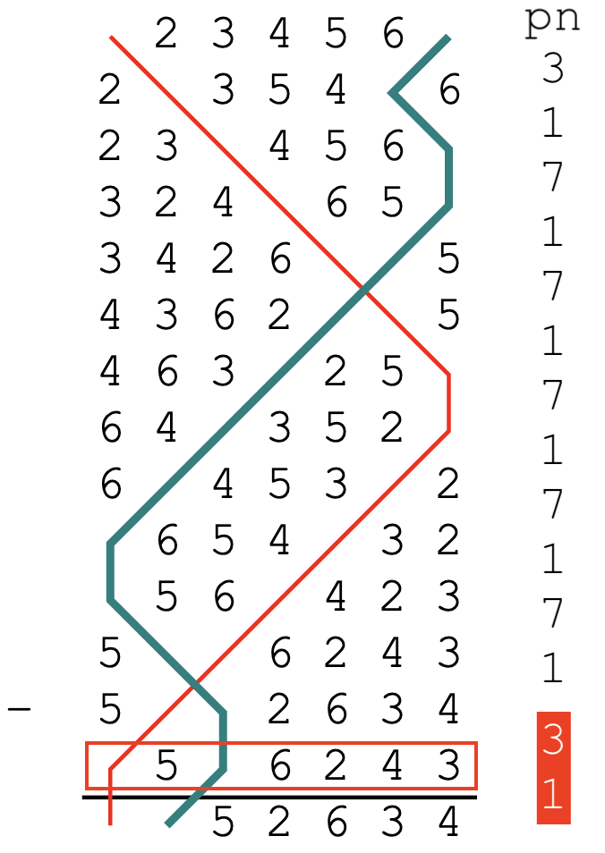

# The Methods tab

The Methods tab is a table which allows you to define the methods which are used in a custom composition. Every composition must have at least one method definition. 

To edit any value in the table, simply click on the relevant cell, then type a new value. Multiple cells can be highlighted by clicking and dragging. Alternatively, you can click on a cell, hold <kbd>Shift</kbd>, and then click on another cell.

If you have filled out the [Title](adding_compositions_tabs_general.md/#title) field under the [General tab](adding_compositions_tabs_general.md), then the Methods tab may already be populated with one or more entries.

## Method title
To manually add methods to the table, begin typing its title in the [Method title](#method-title) column. As you type, Complib will attempt to auto-complete with the titles of any matching public methods, or private methods which you own. 

Once a recognised method title has been entered, the rest of the cells in the row will auto-populate with default values appropriate to that method.

### Deleting methods
Deleting a method's name in the table will delete all its associated information as well.

### Adding methods from a collection
You can add methods directly from an existing method collection. This can be useful if you need to add a large number of methods to the tab.

To add methods from a collection, click on the dropdown menu above the methods table, then click on a method collection. The table will be populated with all the methods in that collection.

It's possible to add methods from multiple collections in this way, though the methods must all be at the same stage for this to work.

Methods already in the table will not be duplicated if they are added again via collection. **If you want multiple copies of a method, you must add them manually.**

## Mnemonic
A method mnemonic is a one- or two-character code which is used to represent the method in the composition's [layout](overview.md/#layout). Mnemonics are displayed by default in compositions of spliced, but they can be enabled for any composition by selecting **Columns > Method mnemonics** in the [composition layout options](layout_options.md).

{width="400"}

!!! warning "Mnemonic restrictions"
    Method mnemonics must have an uppercase letter [A–Z] as their first character. This may be optionally followed by a lowercase letter [a–z] or number [0–9].

    Method mnemonics must be unique. If two methods used in a composition have the same mnemonic, it will cause an error.

### Default mnemonics
When a method is added to the Methods tab, its mnemonic will be the **first letter in its title** by default. Any numbers and special characters at the beginning of the title will be ignored. For example, ['ogwash Delight Minor](https://complib.org/method/30148) has a default mnemonic of "O".

Deleting a method's mnemonic from the table will reset the mnemonic to its default value.

If a method is given a mnemonic which is different from its default in a composition of spliced, then the mnemonic will be appended to the method's name at the bottom of the composition layout.

## Starting place
This field defines the row position above which the changes of the method will be applied. In effect, this defines where the "front" of the change is when ringing the specified method. 

Bells in positions which fall outside the bounds of the method will remain stationary whenever the method is rung in the composition.

??? note "Example"
    ---
    
    {width="150"} &nbsp;&nbsp;&nbsp;&nbsp;&nbsp;
    {width="150"}

    These examples show the first half-lead of [Bristol Surprise Major](https://complib.org/method/19048) being rung on 10 bells, but with different starting places. Since the method's stage has 8 bells, there are two stationary bells.

!!! warning "Starting place restrictions"
    The starting place cannot cause the method to go outside the bounds of the composition's stage. 
    
    The minimum starting place is 1. The maximum starting place is (*N* – *M* + 1), where *N* is the stage of the composition and *M* is the stage of the method.

    This means that it is only possible for a method to have a starting place greater than 1 when used in a composition whose stage is greater than its own, such as in **mixed-stage compositions**.

## Rotate by
This field specifies an amount by which the method's changes will be rotated. 

When Complib pricks (generates the rows of) a composition, it does so by sequentially applying the changes of the method as specified in its [place notation](../methods/place_notation.md). By default, the pricker will start every lead from the first change of the method, given by the first element of the place notation. When it reaches the end, it will start again from the beginning, provided there is no change of method.

When a **Rotate by** value is specified, that many changes and their the corresponding place notation elements will be removed from the start of the lead and reinserted at the end. This modified set of changes has become the definition of a lead of the method within the composition, and the final change is the new leadend change.

??? note "Example"
    ---

    Below are the plain courses of two different rotations of [Double Court Bob Minor](https://complib.org/method/11118), together with their place notations. Lines are drawn through bell number 2, as well as the hunt bell in each case.

    **Rotate by = 0**&nbsp;&nbsp;&nbsp;&nbsp;&nbsp;`-14-36-16-36-14-16`

    

    ---

    **Rotate by = 5**&nbsp;&nbsp;&nbsp;&nbsp;&nbsp;`16-36-14-16-14-36-`

    

!!! warning "Rotate by: restrictions"
    The **Rotate by** value must be between 0 and (*L* – 1), where *L* is the **lead length** of the method. Attempting to specify a **Rotate by** value that falls outside this range will cause an error.

    The lead length of a method is listed under the Properties tab on its Method page (see [Method properties > Miscellaneous](../methods/method_properties.md/#miscellaneous)).

## Start row number
This field specifies which row of the method it should be started from. The default value is 0. Almost all methods are rung with a starting row of 0.

When a Start row number is specified, that many changes will be removed from the front of the first lead of the method. The removed changes are **not** reinserted elsewhere, and the leadend change remains the same. The changes in subsequent (consecutive) leads of the method are not affected. 

Whenenever a change-of-method results in this method being rung, this operation is applied again.

??? note "Example"
    ---

    {width="300"}

    The above diagram shows part of a composition of [Double Norwich Court Bob Major](https://complib.org/method/12470) in which the method's Start row number has been set to 4. Four changes have been removed from the first lead, resulting in a lead which is four rows shorter. 

### Rotate by vs. Start row number
The effects of a method's Start row number on the actual rows of the composition are, in some cases, identical to that of the [Rotate by](#rotate-by) field. The main difference is in which rows of the method will be treated as **leadheads and courseheads** when laying out the composition.

??? note "Example"
    ---

    In this example, a plain course of Grandsire Triples is being rung with a Start row number of 4.

    

    In a blue line diagram, the rows which Complib considers leadheads have horizontal lines drawn above them by default. For coursehead rows, the lines are blue.

    When laid out by leads, the layout for this composition looks like this:

    {width="300"}

    ---

    A touch containing identical rows can be defined using a rotation instead. However, the appearance of the composition will be different. If instead the **Rotate by** value is set to 4, the blue line diagram becomes:

    

    And the corresponding layout:

    {width="300"}

!!! warning 
    A method's Start row number should not be confused with the [composition's Start row number](adding_compositions_tabs_general.md/#start-row-number), which is set under the General tab. 
    
    The difference is that a method's Start row number is part of its definition, and will combine with other parts of the method's definition (such as [Length](#length) and [Lead position row number](#lead-position-row-number)) to determine how every lead of it in the composition is rung. 
    
    By contrast, a composition's Start row number affects only the first lead of the composition, and has no bearing on a method's definition.

    If **both** a method and the composition's Start row numbers are non-zero, then their effects may be combined. This can have unintended consequences. In almost all cases, it is only necessary to set one of them.

## Length
This value specifies how many changes are in each lead of the method. 

Whenever a lead of the method is reached in the composition, Complib will apply the method's changes in sequence until the number of rows in the lead is equal to the Length value.

By default, this value will be equal to the method's **Lead length**, which can be found under the [Properties tab](../methods/overview.md/#properties) on its method page.

??? error "Error: [Method name] (`__`) - The defined length (`__`) is greater than its lead length (`__`)."
    ---
    
    The Length value must be equal to, or less than, the method's Lead length.

    If you want to have a partial lead of a method, there are two ways of achieving the same effect:

    1. You can define a special call, called a **trim**, which removes a number of changes from a lead of the method. See [Calls](adding_compositions_tabs_calls.md) for help with using trims.
    2. You can define a second instance of the same method in the Methods table with a Length that is less than its Lead length. If so, you will need to give this instance a unique [method mnemonic](#mnemonic), and indicate a change-of-method at the appropriate place in the [Calling](adding_compositions_tabs_calling.md).

??? error "Error: [Method name] (`__`) - Length must be greater than zero."
    ---

    Self-explanatory.

## Lead position row number and name
These two values together define the location and name of a **Lead position**.

Lead position
:   A position within a lead of the method where a call can be applied.

The **Lead position row number** is the number of the row to which a call's change is applied, or to which the final change of the call is applied, if it has more than one.

??? note "Example: Grandsire calls"
    ---

    [Grandsire Triples](https://complib.org/method/12415) has 14 rows per lead, and conventionally uses a bob with place notation `3.1`. These changes are applied to rows 13 and 14 in the lead. The Lead position row number is therefore 14.

    {width="250"}

    In the diagram, the highlighted elements of the place notation represent the changes caused by the Bob. The marked row is number 14 in the lead.

??? note "Example: Cambridge S Minor with a halflead call"
    ---

    In this example, an unusual call with place notation `12.36` is made at the half-lead of [Cambridge Surprise Minor](https://complib.org/method/14568). The call affects rows number 11 and 12 in the lead. The Lead position row number for the call is therefore 12.

    {width="250"}

    The highlighted elements of the place notation are the ones caused by the call. The final change of the call affects row number 12, which has been marked in red.

By default, the Lead position row number will be equal to the method's Length value, since most calls occur at the end of a lead.

The **Lead position name** is an identifier which is used to refer to this Lead position in places such as a [call definition](adding_compositions_tabs_calls.md), and in the composition [layout](overview.md/#layout). 

The Lead position name can be any string of characters you like: you can even use emoji or other special symbols. The only requirement is that it must exactly match the name you use for that position in the [Calls tab](adding_compositions_tabs_calls.md).

### Default Lead position names
Every method has a default Lead position name which Complib uses by default. Unlike custom Lead position names, default Lead position names will not be given in the composition's layout.

The default name used depends on the method's type.

LE
:   Short for "Lead end". This is the default Lead position name for methods which are **hunters** (see [Method properties > Hunt bells](../methods/method_properties.md/#hunt-bells)).

SE
:   Short for "Six end". This is the default Lead position name for **principles**, which are methods with no hunt bells. The term "six end" is taken from the name used for the division ends in Stedman, by far the most commonly rung principle.