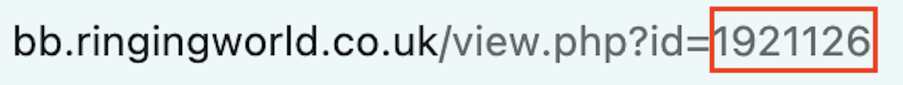

# The Performances tab
The Performances tab is a table which allows you to link the composition to published [BellBoard](https://bb.ringingworld.co.uk/) performances for which it was used.

{width="600"}

The performance table is empty by default. Click **Add performance** to add performances to the table one at a time. Clicking the cross {width="25"} will delete the row from the table.

There are three fields in each row, the first two of which you are able to edit:

### First Performance
This field is a drop down menu allowing you to specify one of two performance types:

First rung
:   The performance is the first known instance of the composition being rung.

Rung
:   A regular performance of the composition.

You should only use **First rung** if you are reasonably sure that the performance in question was the first use of the composition. If you are not certain, you should default to **Rung**.

### Bellboard Id
This is a text field in which you should enter the **BellBoard ID** of the performance in question. This will be a number. A performance's BellBoard ID can be found at the end of its URL:

{width="500"}

!!! note "Performance, not composition!"
    Many Bellboard performances are linked to their composition on a separate page. When entering a performance, be aware that **the relevant ID comes from the URL of the performance, and not the composition**. Entering the ID from the composition URL will cause an error.

### Performance
This field is not editable, but shows any information which is extracted from the BellBoard page corresponding to the entered ID including Performance Title, Ringing Style, Performing Association, Location and Date. Use this field to check that the performance you have input is correct.