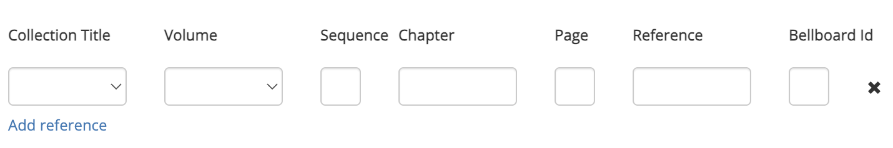

# The References tab
This tab is a table which allows you to link a custom composition to a [Collection](../collections/overview.md). On this page, it will be assumed that you are familiar with collections on Complib and how they work.

Since it is not necessary to add anything to the References tab when creating a custom composition, it is safe to ignore this tab unless you have good reason.

!!! warning "Spurious references"
    Many public collections contain historical data sourced and organised by hand. This can be a rather thankless task, and can be seriously disrupted by the addition of spurious references. 
    
    **Please do not add a composition to a public collection which you do not own unless there is a justifiable reason for its inclusion.**

Click **Add reference** to add an empty reference:

Clicking the cross {width="25"} will delete the reference.

References have a number of data fields, most of which are optional.

### Collection title
(**Required**) The title of the collection in which the composition is to be included. This field is a drop-down menu from which you can select the name of any public collection, or any private collection which you own. 

### Volume
This field is a drop-down menu which allows you to select the relevant volume from the collection, for collections which are organised into volumes. Volumes must have already been created in the collection before they can be selected here.

### Sequence
Allows you to specify a **sequence** number, a positive integer that determines the order in which entries are displayed on a collection page. Smaller numbers have priority over bigger ones.

Sequence numbering takes effect across the **entire collection**. This means that entries which are to be grouped together (particularly entries in the same **chapter**) should all be given the same sequence number.

### Chapter
This field is a text field which allows you to enter the name of a chapter from the specified collection, if it is organised by chapters. If a chapter with the entered name does not already exist in the collection, filling out this field will create a new chapter with that name.

For two entries in a collection to be in the same chapter, the names in their respective chapter fields must **exactly match**.

### Page
The page number of the entry in the collection. This is usually the page number of the source material (e.g. Ringing World issue, CCCBR publication) which forms the basis for the reference.

### Reference
The reference for the entry in the collection. When viewing the collection, this will be the entry for the composition in the column named in the [Referenced by](../collections/creating_collections.md/#referenced-by) field.

Usually a relative reference to a digital source (e.g. a [ringing.org](https://ringing.org/) composition number). The entry in this field is appended to the URL specified on the Collection Properties page for the creation of [Reference Links](../collections/creating_collections.md/#url-for-creating-reference-links).

??? note "Example: 13 to 23-Spliced Surprise Major (Norman Smith)"
    ---
    [This collection](https://complib.org/collection/10508) contains a series of peal compositions in increasing numbers of methods, working up to [5152 23-Spliced Surprise Major](https://complib.org/composition/10023) by Norman Smith.

    In this collection, "**Adds**" has been entered into the **Referenced by** field (which can be seen by {width="25"} **cloning** the collection); this becomes the name of the left-hand column which indexes the collection entries. In the **References** tab on each composition, the **References** field has been filled in with the text which appears in this column.
    
    The author has used this to indicate which new method is included in each peal in the series.

### Bellboard Id
The **ID of a BellBoard performance** which used the composition. This will become a link to the performance in the composition's entry in the collection. See the corresponding section in the [Performances tab](adding_compositions_tabs_performances.md/#bellboard-id) for an explanation of BellBoard IDs. 