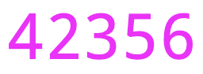
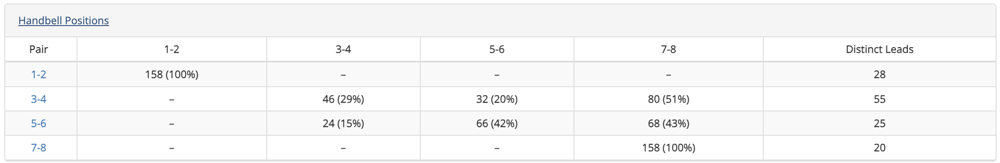

# Composition Pages
The Composition Library has been designed as a library for change ringing **compositions**. In the most general terms, a composition is a specified **calling** for a change ringing performance. A composition is stored in Complib as this calling, together with specified method(s) for which it has been designed.

Complib automatically **pricks** (generates the rows of) any composition when it is entered in order to establish its **truth**. Stored compositions are then given their own dedicated pages, which might look something like this:

At the top of the page is the composition's user-defined **title**, and its **star rating**. The star rating displays a weighted average of any submitted ratings by registered users.

## Toolbar
To the right of the composition title and rating is the **toolbar**:

The toolbar buttons can be identified by hovering over them. Some of the toolbar buttons **may not be visible on every method page**, and to every user. The buttons are, from left to right:

{width="50"} Find methods true to this
:   Begins an [extended search](../search/extended_search.md) of methods in the Composition Library to determine which ones are true to this composition. This search will include any [private methods](../methods/adding_methods.md/#private-and-public-methods) you have defined. Only available to registered Power Users.

{width="50"} Add to collection
:   Adds the composition to a [collection](../collections/overview.md) of your choice.

{width="50"} Publish
:   Publishes the composition to the `Public` library. Only available to registered users, for compositions which you own.

{width="50"} Clone
:   Creates a duplicate of the composition on the **Add composition** page, which you can then edit (see [Creating a new composition](adding_compositions_overview.md)). Only available to registered users.

{width="50"} Edit
:   Opens the composition in the **composition editor**. Only available to registered users, when viewing a private composition which you own.

{width="50"} Share
:   Displays a public link to the composition page so it can be shared with others. 

    !!! note
        The composition will be visible via the link **regardless of whether the composition itself is public**. This is useful if you want to share a composition without publishing it.
        
        See [Creating a new composition > Publishing compositions](adding_compositions_overview.md/#publishing-compositions) for more information on what it means for a composition to be public or private.

{width="50"} Export rows
:   Opens a new browser tab containing the pricked rows of the composition in plaintext form.

{width="50"} Printable version
:   Opens a new browser tab which displays the human-readable layout of the composition in a form that's easy to print. Its appearance is determined by the currently configured [composition layout options](layout_options.md).

## Tabs overview
A composition page is subdivided into various expandable tabs (click on the name of a tab to skip to a detailed description of its contents):

[Layout](#layout)
:   The human-readable form of the composition. The appearance of this can be adjusted using the [composition layout options](layout_options.md).

[Blue Line](#blue-line)
:   The pricked rows of the composition, with (or without) an overlaid blue line. The appearance of this can be adjusted using the [blue line display options](../methods/blueline_options.md).

[Music Score](#music-score)
:   The music score breakdown of the composition with respect to a specified [**music scheme**](../advanced/music_schemes.md). Users can use one of the default schemes (such as for half-muffled ringing), or specify their own.

[Handbell Positions](#handbell-positions)
:   Information about which positions each handbell pair rings during the composition, including the number of leads rung and their relative frequency.

[Properties](#properties)
:   The technical features of the composition, such as its **length**, **number of parts**, whether it is **all-the-work**, and more.

[ATW Analysis](#atw-analysis)
:   A comprehensive analysis of the all-the-work property for every method included in the composition.

[Related Compositions](#related-compositions)
:   A list of all compositions which are related to the current one, i.e., because they are related by some **transformation** such as rotation or reversal, or because they have the same calling but different specified methods.

[Performances](#performances)
:   Historical information about occasions when the composition has been performed,  with links to the relevant Bellboard page.

[References](#references)
:   A list of all accessible **collections** containing the current composition. If you own a private collection containing the composition, it will be included here.

[Library Details](#library-details)
:   Information about to the composition's Complib entry, including which **library** it is contained in, its **Composition Id**, any **Notes** included by the publisher, etc.

## Layout
This tab gives the **calling** for the composition in human-readable form. With default settings, the layout should look something like this:

Generated title
:   The composition's generated title is given automatically by Complib, and may differ from its user-defined title. The generated title        specifies, in order:

    -   the **length** of the composition;
    -   (if a single-method composition) the **title of the method** it is defined for; or
    -   (if a spliced composition) the **number of methods**, their **common class** (if it exists) and **stage(s)**;
    -   the opus number and name (if it exists).

Attribution
:   If the composition has been attributed to anyone, it will be noted here. Usually this will be the name of the composer(s) or arranger(s).

Calling
:   The **calls** which make up the composition, together with any **supplementary information**, including:

    -   **Number of parts** (for multipart compositions);
    -   **Modifications to the calling** (e.g., calls or methods which change in certain parts);
    -   **The observation bell**, for compositions in which it is not the highest numbered bell;
    -   **Turning course definitions**;
    -   **Non-standard starts** (e.g., for compositions beginning at backstroke, or at a point other than the start of a lead/division);
    -   **Non-standard or user-defined calls**: these will be defined in words (e.g. Far, Near, Grandsire) or using [place notation](../methods/place_notation.md).

Method details
:   For spliced compositions, the methods rung will be listed here. The readout will give the number of rows of each method in the composition, and their corresponding **method mnemonics** if disambiguation is needed. Clicking on a method's name will take you to its [method page](../methods/overview.md).

Music
:   A list of common **musical metrics** is given for the composition, together with **named rows** it features such as Queens or Tittums. See also: [Music score](#music-score).

Customise layout options
:   Users can adjust the form and style of the layout to suit a wide variety of needs and preferences (see [Customising composition layouts](layout_options.md)).

### Layout colour coding
Various elements of the composition layout will change colour when displaying a composition which is false. The specific elements which change colour will depend on the format of the layout.

Course/leadheads in magenta ({ width="50" }) indicate that the course/lead contains a row which is false against another row which appears later in the composition.

Course/leadheads in red ({ width="50" }) indicate that either: 

- The course/lead contains a row which is false against another row which appears earlier in the composition; or 
- The course/lead is false against itself.

## Blue Line
When expanded, this tab will render all the rows of the composition in accordance with the configured **blue line options**. By default, it should look something like this:

Much like those for methods, the blue line display for compositions is highly customisable. For an explanation of most of the available options, see [Methods > Customising the blue line](../methods/blueline_options.md). 

There are a number of blue line options which are unique to compositions. These are:

-   **Calls**: displays calls at the points where they occur. Default: **on**.
-   **Plains**: marks plain leads/divisions, similarly to leads with calls. Default: **off**.
-   **Method mnemonics**: Displays the method mnemonic of the method currently being rung at the beginning of each lead. Default: **on**.

!!! warning
    By default, the blue line tab will attempt to display the entire touch at once. For long lengths, or compositions on higher numbers, the rendering process may take some time. 
    
    The blue line display will also auto-resize to fit the width of your browser window. For longer compositions on higher numbers, this may result in bell numbers which are very small.

    In these cases, you may wish to adjust the number of columns or rows which are displayed in the [blue line display options](../methods/blueline_options.md).

## Music Score
This tab calculates a numerical score for the composition based on the various metrics, or **tests**, specified in a **music scheme**. The table in the tab provides a breakdown of this score: for each applicable test, the number of rows in the composition which satisfy the test is given.

The music scheme used to calculate the score can be changed via the dropdown menu at the top right of the tab. 

!!! warning
    If the selected music scheme has no **applicable tests** which can be scored against, then the Music Score tab will be left empty.

Clicking on a test will expand that test further:

Most of the tests are self explanatory. For a full description, together with information about how to define your own tests, see [Music schemes](../advanced/music_schemes.md).

## Handbell Positions
For handbell ringers, it is often useful to know what **positions** your two bells are in relative to each other. Each handbell pair has a corresponding position (e.g 3-4 position) which is uniquely determined by what that pair does in the **plain course**.

When expanded, the tab displays a table:

Down the left hand side of the table is listed each handbell pair. The column headings give the corresponding positions. The table entries specify how long the given handbell pair spends in that position, both as a number of leads and as a percentage of the whole composition.

The rightmost column lists the number of distinct leads that each handbell pair rings throughout the composition. This is used to calculate the relative **simplicity** of the composition for a given handbell pair.

For spliced compositions, clicking on the name of the handbell pair will further expand the table to show a breakdown by individual method.

## Properties
For a detailed explanation of the information contained in the properties tab, see the dedicated page on [Composition properties](composition_properties.md).

## ATW Analysis
This tab gives an analysis of the work rung by each bell in each method in the composition. It is often the case that ringers will look for a composition which is "all the work", meaning that all working bells ring every place bell of every method. On the other hand, a composition which requires knowledge of only a few leads of a method can be useful for those still learning it.

When expanded, the tab will look something like this:

{width="500"}

Each column represents the **grid** of one lead of the given method, and gives the analysis for the bell indicated at the top of the column.

The numbers in the grid represent **the number of times that the specified bell rings in that grid position in the method, over the whole composition**. 

The numbers 1 to 9 in any position denote that many instances of the bell ringing in that position. A greater-than symbol (`>`) in means the bell rings in that position 10 times or more. A red square means the bell never rings in that position.

??? note "Example"
    ---
    

    The image above shows the first half of the grid of [Lessness Surprise Major](https://complib.org/method/16808), as rung [in this composition](https://complib.org/composition/24120). Bell 1 is the hunt bell, and only ever rings in the positions described by its hunt path. Bells 2 through 6 are do all the work in the given method, because the only positions they do not ring are those occupied by the hunt bell.

    By contrast, Bells 7 and 8 do not do all the work. Bell 7 never rings 4ths place bell, Bell 8 never rings 3rds place bell, and neither of them ring 2nds place bell. The missing place bells can be identified by the positions of the red squares in the first row of the method.

### ATW in variable hunt, variable cover and mixed-stage compositions
The requirements for ATW may be different depending on whether the composition is **variable hunt**, **variable cover** or **mixed stage**. For an explanation of these terms as well as their effects on the determination of ATW, see [Composition Properties](composition_properties.md/#structure).

## Related Compositions
This tab lists any compositions which are related to the current composition (and which you have access to). Each similarity relation is reciprocal: A is related to B in the same way that B is related to A. There are a number of different ways in which two compositions can be related, and they may be related in multiple ways at once. 

The types of similarity relation are:

Rotated calling
:   The two compositions define the same sequence of calls, but beginning at different points.

Transposed calling
:   The two compositions have the same sequence of calls, but with the calling positions transposed.

Reversed calling
:   The two compositions have callings which are reverses of each other.

Identical calling/changes/rows
:   The two compositions have identical callings/changes/rows. Compositions related in these ways are effectively the same, although there may still be good reason to document them separately.

## Performances
This tab lists any performances of the composition which have been submitted.

{width="500"}

Each entry has three fields:

Date
:   The date on which the performance was rung.

Type
:   Specifies one of a number of performance types:

    - **First rung on towerbells/handbells/etc.**: a performance which is recognised as being the first performance of the composition using a particular Ringing Style.
    - **[Length] on towerbells/handbells/etc.**: A recognised performance of the specified length (Peal, Quarter Peal, etc.) using the composition and the specified Ringing Style.

Details
:   The published details of the performance: title, performing Guild or Association (if given), location, and conductor (if given). The entry in this field acts as a link to the corresponding Bellboard performance, provided it exists and has been linked to the composition page.

## References
This tab lists all collections which you have access to and which reference the current composition (inaccessible private collections will not be displayed). Each entry has four fields, with every entry acting as a link to the relevant Complib page:

Collection
:   The name of the collection to which the composition belongs.

Chapter (optional)
:   The chapter of the composition's entry in the collection (if specified).

Page (optional)
:   The page number of the composition's entry in the collection (if specified), or the page number in an external reference. If the reference is to an external source, this entry may be a clickable link to that source.

Reference (optional)
:   In the case that the collection is **referenced** by a certain index, the corresponding reference for the composition within the collection. If the reference is to an external source, this entry may be a clickable link to that source.

For more on references and how they relate to collections, see [Collections](../collections/overview.md).

## Library Details
This tab lists some of the composition's Complib-specific metadata.

Library
:   The [library](../concepts.md/#the-libraries) which contains the composition. The only two libraries for compositions are **Public** and **Private**.

Notes
:   Any notes provided by the compositions's publisher.

Composition Id
:   The composition's numerical ID. This is the number featured at the end of a composition page's URL. A [Quick search](../search/quick_search.md) using a Composition Id will navigate directly to that composition's page.

Created on
:   The date and time at which the composition was created and the name of the user who created it.

Modified on
:   The date and time at which the composition was last modified and the name of the user who modified it.

Published on
:   The date and time at which the composition was made public.

!!! note
    Times and dates are given in Local Time.