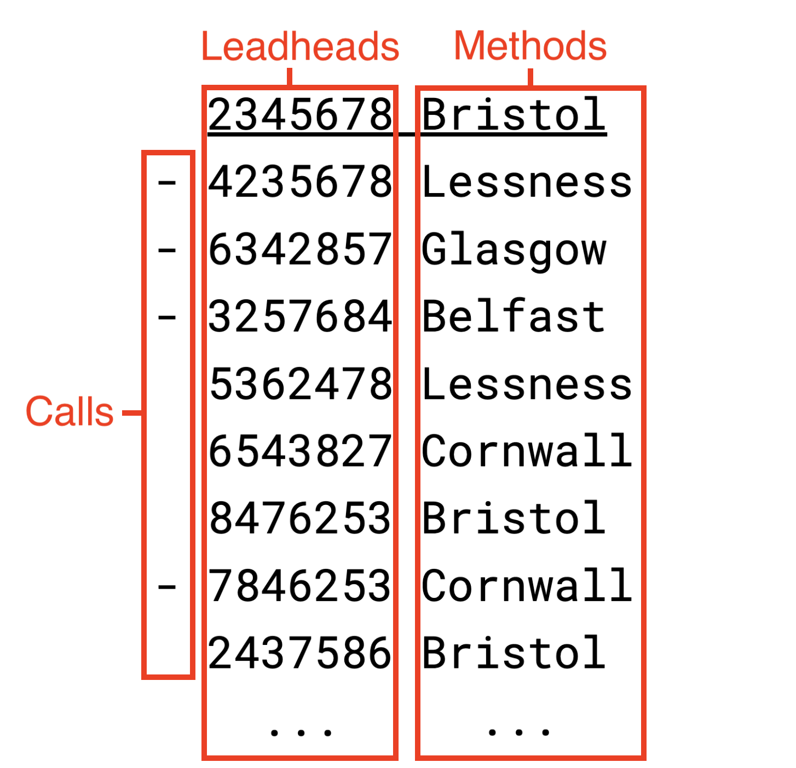

# How to read compositions
Compositions have historically been recorded in a variety of ways. A host of conventions have developed over centuries, some of which may not be especially obvious to the uninitiated.

This section is intended as an introduction to reading and interpreting compositions as they are commonly encountered, such as in your Ringing World Diary, or on Complib itself. 

The examples given, while fairly typical, are not intended to be representative of all the different kinds of compositions you might encounter. However, understanding them will equip you well to approach a broad spectrum of unfamiliar compositions and figure out how they work for yourself.

!!! note "Callings versus Layouts" 
    It's important to remember that **a composition is defined by its calling**, but not by its layout or style of presentation. The same composition can be represented in many different ways. Indeed, Complib gives users [a lot of control](layout_options.md) over the way that any composition appears to them. 

## Calling formats
There are two generally distinct types of format which callings use: those laid out by **courses**, and those laid out by **leads**. How you read a composition and derive calling information from it depends on which layout type has been used.

### Laid out by courses
A typical composition laid out by courses may look something like this:

*Example: [1280 5-Spliced Surprise Major](https://complib.org/composition/141337) by Robert D S Brown*

The calling is laid out in a table, which should be read left-to-right, top-to-bottom. Each table row represents a course (or a set of courses). Some of the labelled elements may not be present, while others not shown here might be included. Click on the name of an element below to navigate to a section explaining it in more detail.

[Courseheads](#courseheads-and-leadheads)
:   The first row of each course (or set of courses) in the touch. Since all compositions begin from rounds, the first coursehead is almost always rounds. By convention, bells which do not change position between courseheads are usually omitted altogether.

[Calls](#calls)
:   The calls which, together with the method(s), produce the rows of the composition. Calls are represented by symbols arranged into columns. 

[Calling positions](#calling-positions)
:   The headings of the columns, which indicate when the calls in that column are made. Most compositions use calling positions with standard meanings which are commonly understood.

[Method mnemonics](#methods-and-method-mnemonics)
:   Used in compositions of Spliced to indicate changes of method. Each method in the composition is given an alphanumeric code. Each instance of a mnemonic represents one lead of its associated method. It is common to insert periods (or sometimes commas) between mnemonics to indicate where the calls occur.

### Laid out by leads
A single-method composition laid out by leads might look something like this:

{width="400"}

*Example: [1260 Grandsire Triples](https://complib.org/composition/123841) by Daniel W Brady*

The calling is laid out as a number of columns which should be read top-to-bottom. Each line represents a call made during the composition.

[Leadheads](#courseheads-and-leadheads)
:   The first row of the lead in the touch indicated by the lead number. Since all compositions start from rounds, the first leadhead is almost always rounds. By convention, bells which do not change position between leadheads are usually omitted altogether.

[Lead numbers](#calling-positions)
:   The number of leads after which the given leadhead occurs, measured from the previous leadhead. In the above example, the second leadhead is the fourth one reached after rounds. The next comes two leads after that, and so on.

[Calls](#calls)
:   The calls which, together with the method(s), produce the rows of the composition. When laid out by leads as above, it is assumed that a bob occurs unless another type of call is explicitly indicated.

A composition of Spliced can also be laid out by leads, and may look something like this:

{width="400"}

*Example: [1280 5-Spliced Surprise Major](https://complib.org/composition/141337) by Robert D S Brown (excerpt)*

Again, the calling is laid out in columns, and read left-to-right, top-to-bottom. In this case, every leadhead and call in the composition is given explicitly. 

The composition fragment above starts from rounds, the first leadhead, and the first method is Bristol. The dash (–) to the left of the next leadhead indicates that a bob must be called in order to reach it. Then, the method changes to Lessness. 

At the end of the lead of Lessness, another bob is called to bring up the next leadhead, the method changes to Glasgow, and so on.

## Courseheads and leadheads

## Calls

## Calling positions
Calling positions indicate to the conductor exactly where a call is supposed to take place. There are a number of different conventions regarding calling positions, and a large number of standard names which conductors and composers need to be familiar with. 

See the dedicated page on [Calling positions](calling_positions.md) for a full explanation of the different types of calling position, as well as a full list of the standard calling position names which Complib uses.

## Methods and method mnemonics

## Multipart compositions