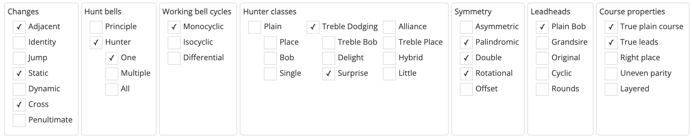

# Method properties
When a method is added to Complib, various properties of the method are determined in order to classify it, as well as highlight any of its notable features. These properties are listed in the method page's **Properties tab**.

When expanded, the top of the tab shows a number of checkboxes, each of which corresponds to a different potential feature of the method.

## Changes
A method consists of a sequence of **rows** rung in sequence. The relationship between two adjacent rows with regard to how bells move from one row to the other is referred to as a **change**. There are a number of different types of change that can be made between subsequent rows of a method:

Adjacent
:   The method only contains changes where bells move at most one place between rows. All traditional methods fall into this category.

Identity
:   The method contains a change where no bells move place.

Jump
:   The method contains a change where a bell moves more than one place (for example, the change between the rows ``1 2 3 4 5 6`` and ``2 3 1 4 6 5``). Methods containing jump changes are referred to as Jump methods.

Static
:   The changes of the method are fixed, which is to say that they are not altered as the method is rung (unless a **call** is made).

Dynamic
:   The changes of the method are not fixed, and are dynamically altered as the method is rung. One type of "method" with dynamic changes is the loosely defined family of **Dixonoids**, where places are made depending on which numbered bell is leading. Complib does not currently support the definition of methods with dynamic changes.

## Hunt bells
Methods can fall into one of two distinct categories depending on the presence or absence of a **hunt bell**.

!!! hint "Definition"
    A **hunt bell** is a bell which returns to the same place at the start of each lead/division.

Principle
:   A method with no hunt bells (e.g. Stedman, Erin).

Hunter
:   A method with one or more hunt bells. Hunters are further classified depending on the number of hunt bells:

    * **One** indicates that there is a single hunt bell (e.g. Plain Bob).
    * **Multiple** indicates that there are multiple hunt bells (e.g. Grandsire).
    * **All** indicates that all the bells are hunt bells (e.g. [12 Victoria Street Surprise Minor](https://complib.org/method/29824)). In this case, the plain course of the method is a single lead/division long. Historically, methods of this kind came under the umbrella classification of **blocks**, a term which has since been retired.

## Working bell cycles
All bells in a method which are not hunt bells are referred to as **working bells**. The plain course of a method involves the working bells moving through one or more **cycles** of place bells.

Monocyclic
:   The working bells are all part of the same cycle: all working bells ring all the distinct place bells during a plain course. The plain course is the same length as the number of leads in the cycle.

Isocyclic
:   The working bells are divided up into two more cycles, all of which are the same length. In this case, the plain course is the same length as the number of leads in any one of the cycles.

Differential
:   The working bells are divided up into two or more cycles of different lengths. Here, the plain course is equal to the **least common multiple** of the lengths of all the cycles.

## Hunter classes
All methods which are hunters (see [Hunt Bells](#hunt-bells)) can be further divided into a number of different **classes**. The different hunter classes are arranged in a hierarchy as follows:

- **Plain**
    * Place
    * Bob
    * Single\*
- **Treble Dodging**
    * Treble Bob
    * Delight
    * Surprise
- **Alliance**
- **Treble Place**
- **Hybrid**
- **Little**\*\*

A method with a single non-stationary hunt bell will fall into one and only one hunter class.

!!! note
    \* Single is not strictly speaking a method class, but a specific subtype of Plain method with certain properties.

    \*\* A method may be Little in addition to its main hunter class.

For a detailed explanation of the different hunter classes and how they are distinguished, please refer to [Section 4 of the Central Council Framework](https://framework.cccbr.org.uk/version2/classification.html).

## Symmetry
A **symmetry** is a transformation (rotation, reflection, translation, etc.) which leaves the appearance of something unchanged. A method has one or more **symmetry types**:

Asymmetric
:   The method has no symmetry.

Palindromic
:   The method is the same when rung forwards and backwards. Equivalently, the method's **line** is the same when reflected in an axis perpendicular to the direction of the line.

Double
:   The method is the same when transformed in any of the following equivalent ways: 

    - The method's place notation is **inverted** (see [Place notation](place_notation.md)).
    - The method's rows are written back to front (e.g. `1 2 3 4` becomes `4 3 2 1`). 
    - The method's line is viewed from the reverse side of a sheet of paper, or held up to a mirror.
    - The method's line is reflected in an axis parallel to the direction of the line and shifted along the same axis by some amount (known mathematically as a **glide reflection**).

Rotational
:   The method is the same when rotated one half-turn about a point.

For palindromic methods there is also one symmetry subtype:

Offset
:   A palindromic method whose axis of symmetry is not at the halfway point of its place notation. Many twin hunt methods such as Grandsire fall into this category.

For a visual demonstration of the different symmetry types, see [this infographic](https://framework.cccbr.org.uk/version2/images/classification/symmetries.pdf).

## Leadheads
Almost all methods (currently all methods in Complib's `CCCBR` library) have a plain course which can be divided into one or more sections of fixed, finite length, which are called **leads** or **divisions**. It is common to refer to the starting row of a lead (or division) as the **leadhead** (or **division end**). The collected set of leadheads of a method may satisfy one of a number of conditions:

Plain Bob
:   The leadhead rows form a (non-trivial) subset of the leadheads of Plain Bob on the same number of bells.

Grandsire
:   The leadhead rows form a (non-trivial) subset of the leadheads of Grandsire on the same number of bells.

Original
:   The leadhead rows form a (non-trivial) subset of the division ends of Original on the same number of bells.

Cyclic
:   The leadhead rows form a (non-trivial) subset of the cyclic rotations of rounds on the same number of bells (e.g. `2 3 4 5 1`, `3 4 5 1 2`, etc.). 

Rounds
:   The method has only one lead/division and therefore only one leadhead, which must necessarily be equal to rounds on the same number of bells.

!!! note
    There are methods whose leadheads do not fall into any of the above categories (though a significant majority of methods do).

## Course properties
Taken as a whole, the plain course of the method can have certain properties which may be of particular interest:

True plain course
:   The method has a plain course which is **true**.

True leads
:   The plain course comprises leads which are **individually true** (but which may be **false** against each other).

Right place
:   All **places** in the plain course are made **right** (i.e., rung handstroke-backstroke).

Uneven parity
:   For principles, this means that the plain course contains an unequal number of **odd** and **even** rows (see [Row Parity](../advanced/row_parity.md)). For hunters, this means that there are an unequal number of odd and even rows for any given position in the hunt path of the **principal hunt bell**.

Layered
:   Each row of the plain course can be separated into two or more **non-overlapping groups** of adjacent bells such that no bell strays outside of its starting group during the course. For example, [Plain Bob Minor](https://complib.org/method/11349) rung on 8 bells with 7 and 8 dodging behind is equivalent to the layered method [Broadley Little Bob Major](https://complib.org/method/29080).

## Miscellaneous
In addition to the above, the properties tab also lists miscellaneous information about the method in text form. The listed items are:

Place notation
:   The method's place notation, given in Method XML format (see [Place notation](place_notation.md)).

Leadhead
:   The row reached after a single plain lead and, if applicable, the method's alphanumeric [leadhead code](../advanced/leadhead_codes.md).

Divisions
:   Gives the length and arrangement of the method's division(s) if applicable.

    The **length** of each division is the number of rows it contains.
    
    If the method has more than one division per lead, the lengths of each division are listed and separated by colons (e.g. `6:6`).
    
    If the method is usually started at a point **other than the start of a division**, the starting point for the first division will be specified. For example, `6:6 after row 2` means that the divisions have lengths of 6 and 6, with the first division starting after row 2.

    !!! tip
        When counting rows, remember that the method starts from row 0.

Default calls
:   The **call type** determines which calls will be used by default when creating a composition for the method. The call types that Complib recognises are:

    - **Near**: calls default toward the front of the change (e.g. 4ths place bobs).
    - **Far**: calls default toward the back of the change (e.g. n-2's place bobs).
    - **Mixed**: the method uses multiple call types.
    - **Grandsire**: the method uses Grandsire-type calls.
    - **Stedman**: the method uses Stedman-type calls.
    - **None**: the method has no specified call type.

Method above/below
:   For methods which are hunters, if the method shares **above/below work** with another method that was rung prior to it, that method will be listed here. The method listed will (with some exceptions) be the earliest applicable method rung to a peal.

    !!! note 
        The exceptions to this are where a method which is much more widely known was nevertheless rung to a peal *after* another more obscure method sharing the same above/below work. One such example is [New Cambridge Surprise Major](https://complib.org/method/17029), which was pealed almost 50 years before [Cambridge Surprise Major](https://complib.org/method/16694) even though the latter was (pretty obviously!) known to the Exercise before the former.

FCH Groups
:   Lists the codes for the method's **false coursehead groups** (if applicable). See [this section of the Central Council Framework](https://framework.cccbr.org.uk/version2/falsecourseheads.html) for a definition of the false course head groups.

Accepted extension path
:   For methods with a compliant **extension** or **contraction** which has been named, lists the extension path(s) used to derive the accepted extension(s) or contraction(s) (see [Extensions](../advanced/extensions.md)).

Compositions designed for this method
:   The number of (published) compositions on Complib which include this method in their definition. Clicking on the number will jump to a search which lists them all.

Leads in course
:   The number of leads in the plain course of the method. This is equal to the least common multiple of the lengths of its working bell cycles (see [Working bell cycles](#working-bell-cycles)).

Lead length
:   The number of rows in a plain lead. This is also equal to the number of elements in the method's expanded place notation.

Plain course length
:   The number of rows in the method's plain course. This is equal to the number of leads in the course multiplied by the lead length.

Hunt bells
:   The number of bells which return to the same position they started in at the end of each lead (see [Hunt bells](#hunt-bells)).

Working bells
:   The number of bells which end each lead in a different position from where they started. Also equal to the total number of bells minus the number of hunt bells and stationary bells.

Stationary bells
:   The number of bells which do not change place for the whole of the plain course.

Maximum blows in one place
:   The maximum number of times any bell remains in the same place between consecutive rows of the method.