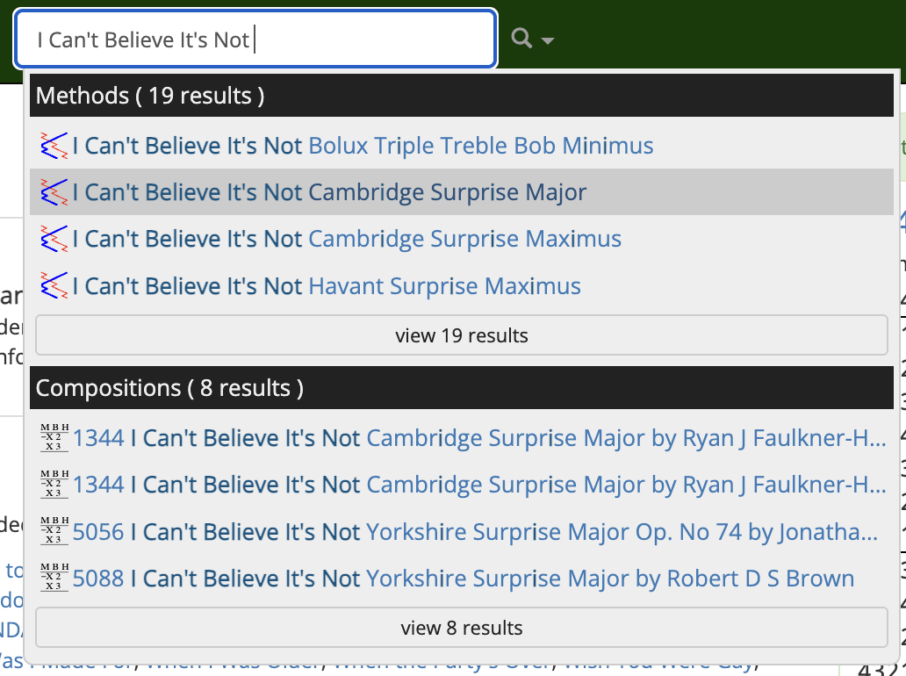
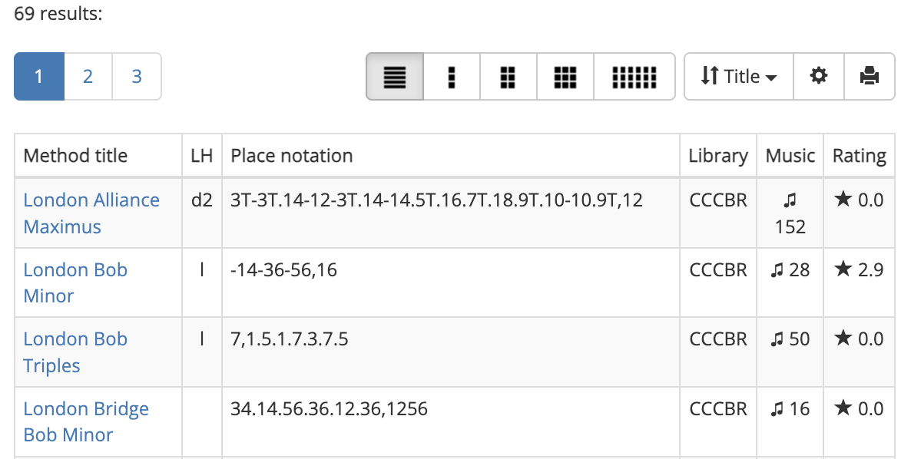

# Quick search
There are a number of different tools at your disposal for searching the Composition Library. The simplest of these is **Quick search**.

You can perform a Quick search via the Navigation bar at the top of every page. Simply start to type the name of what you're looking for in the search field, and Complib will begin suggesting possible matches.

{width="500"}

Click on an item to navigate to the relevant page.

??? hint "Quick search tips"
    ---
    Use unique identifiers
    :   You can speed up a Quick search by entering text which will uniquely identify the thing you are looking for. For example, say you're looking for a composition of Cambridge Surprise Royal. Rather than use the whole method name, a shortcut might be to type "**cam sur roy**". Adding a number of changes at the front, such as 5040, will narrow the search down to compositions even faster.

    Hidden keywords
    :   Some collections have hidden keywords which help to identify them more quickly in searches, even if the keyword is not in its title. For example, a search for "**ppe 7**" will return a number of collections relating to the Project Pickled Egg "Core 7". Try it yourself and see!

Quick search results will be organised into groups depending on their type. The four types are **Methods, Compositions, Collections** and **Composers**.

At the bottom of each group is a link to **"view `__` results"**. Clicking on this will take you to a page which lists all the search results in that group.

{width="500"}

!!! note
    You must be a registered user and be logged in to view the complete list of search results.

Quick search is very useful if you already know more or less what you are looking for. But maybe you don't know the name of a method, only some of its features. Or perhaps you'd like to look for compositions which only use "standard" bobs and singles.

Fortunately, Complib lets you perform searches like these very easily with dedicated search pages for [methods](method_search.md), [compositions](composition_search.md) and [collections](collection_search.md).
